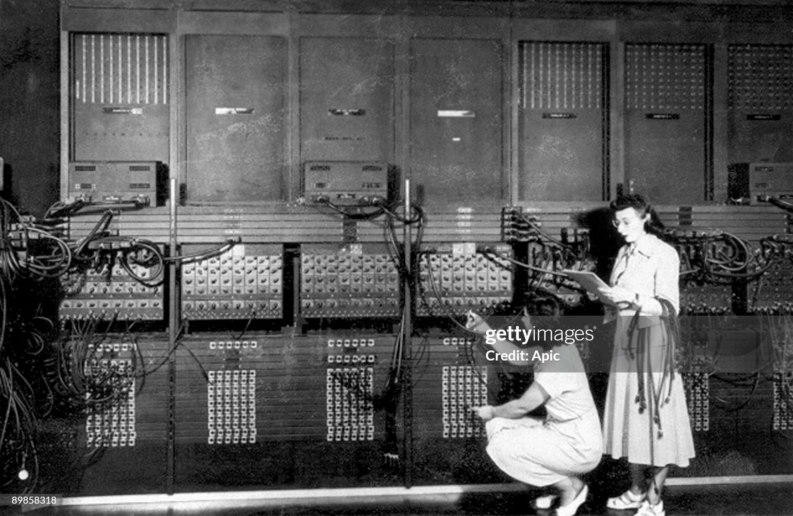
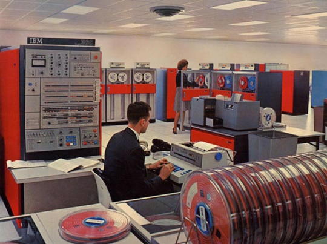
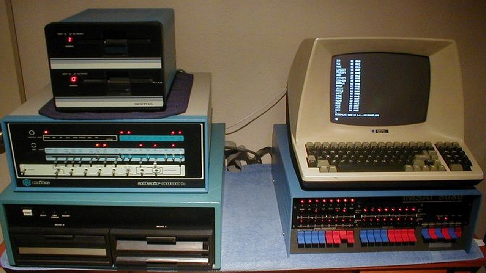
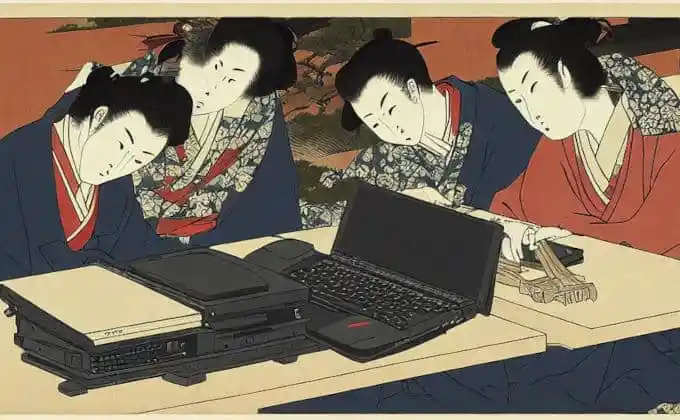
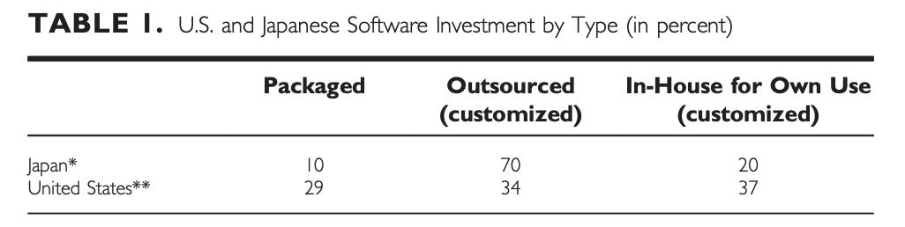

<!-- https://github.com/marp-team/marp-cli/blob/main/docs/bespoke-transitions/README.md#prerequisite -->

<!-- headingDivider: 2 -->
<!-- _class: lead -->

# デジタル技術による職業変容の勃興からDXまで

# DXとは？を紐解くと、計算機資源（とそれを支えるデジタル技術）によって人の仕事が変化し始めたのがどこからか？まで遡る
## 1946年 ENIAC



電子計算機によって、軍事計算や科学研究を高速で行えるようになった

そこから金融のように業務実態がDigitである世界へ進出していく

## 1960年代


政府、銀行、大企業における会計や在庫管理、給与計算まで広がる


## ソフトウェア危機
ハードウェアの性能向上とコスト低下とは対照的に、ソフトウェア開発のコストが増大し需要に供給が追いつかなくなる ([ソフトウェア危機 - Wikipedia](https://ja.wikipedia.org/wiki/%E3%82%BD%E3%83%95%E3%83%88%E3%82%A6%E3%82%A7%E3%82%A2%E5%8D%B1%E6%A9%9F#:~:text=%E3%82%BD%E3%83%95%E3%83%88%E3%82%A6%E3%82%A7%E3%82%A2%E5%8D%B1%E6%A9%9F%EF%BC%88%E3%82%BD%E3%83%95%E3%83%88%E3%82%A6%E3%82%A7%E3%82%A2%E3%81%8D%E3%81%8D%E3%80%81Software%20Crisis%EF%BC%89%E3%81%A8%E3%81%AF%E3%80%81%E9%AB%98%E6%80%A7%E8%83%BD%E5%8C%96%E3%81%99%E3%82%8B%E3%83%8F%E3%83%BC%E3%83%89%E3%82%A6%E3%82%A7%E3%82%A2%E3%81%AE%E3%82%B3%E3%82%B9%E3%83%88%E3%81%AF%E4%BD%8E%E4%B8%8B%E3%81%99%E3%82%8B%E4%B8%80%E6%96%B9%E3%80%81%E8%A4%87%E9%9B%91%E5%8C%96%E3%81%99%E3%82%8B%E3%82%BD%E3%83%95%E3%83%88%E3%82%A6%E3%82%A7%E3%82%A2%E9%96%8B%E7%99%BA%E3%81%AE%E3%82%B3%E3%82%B9%E3%83%88%E3%81%AF%E4%B8%8A%20%E6%98%87%E3%81%99%E3%82%8B%E5%82%BE%E5%90%91%E3%81%8C%E7%B6%9A%E3%81%8F%E3%81%93%E3%81%A8%E3%81%AB%E3%82%88%E3%82%8A%E3%80%81%E5%B0%86%E6%9D%A5%E7%9A%84%E3%81%AB%E3%82%BD%E3%83%95%E3%83%88%E3%82%A6%E3%82%A7%E3%82%A2%E3%81%AE%E4%BE%9B%E7%B5%A6%E3%81%8C%E9%9C%80%E8%A6%81%E3%82%92%E6%BA%80%E3%81%9F%E3%81%9B%E3%81%AA%E3%81%8F%E3%81%AA%E3%82%8B%E3%81%A8%E3%81%84%E3%81%86%E8%80%83%E3%81%88%E6%96%B9%E3%81%A7%E3%81%82%E3%82%8B%E3%80%82%E3%82%BD%E3%83%95%E3%83%88%E3%82%A6%E3%82%A7%E3%82%A2%E5%8D%B1%E6%A9%9F%E3%81%AF21%E4%B8%96%E7%B4%80%E4%BB%A5%E9%99%8D%E3%82%82%E7%B6%9A%E3%81%84%E3%81%A6%E3%81%84%E3%82%8B))。当時は現在よりもさらに工学として未成熟であり、正しく可読性が高く検証可能なプログラムを書くこと自体が困難であった。

そこで世界で初めて、ソフトウェアに関するNATO会議が開かれ、手法の体系化や開発プロセスの標準化について議論がされるようになった。ソフトウェア工学の始まりもそこだと言われる。


<!--
この問題に対処するため、1968年にNATO会議（ガルミッシュ会議）が開かれ、“software crisis”という言葉もそこで生まれています ([ソフトウェア危機 - Wikipedia](https://ja.wikipedia.org/wiki/%E3%82%BD%E3%83%95%E3%83%88%E3%82%A6%E3%82%A7%E3%82%A2%E5%8D%B1%E6%A9%9F#:~:text=%E7%99%BA%E3%81%AE%E7%94%9F%E7%94%A3%E6%80%A7%E3%82%92%E6%A0%B9%E6%9C%AC%E7%9A%84%E3%81%AB%E5%90%91%E4%B8%8A%E3%81%95%E3%81%9B%E3%81%AA%E3%81%84%E9%99%90%E3%82%8A%E3%80%81%E3%82%BD%E3%83%95%E3%83%88%E3%82%A6%E3%82%A7%E3%82%A2%E3%81%AE%E4%BE%9B%E7%B5%A6%E3%81%8C%E5%A2%97%E5%A4%A7%E3%81%99%E3%82%8B%E9%9C%80%E8%A6%81%E3%81%AB%E8%BF%BD%E3%81%84%E3%81%A4%E3%81%8B%E3%81%9A%E3%80%81%E5%8D%81%E5%88%86%E3%81%AA%E5%93%81%E8%B3%AA%E3%82%92%E6%BA%80%E3%81%9F%E3%81%99%E3%82%BD%E3%83%95%E3%83%88%E3%82%A6%E3%82%A7%E3%82%A2%E3%81%AE%E6%8F%90%E4%BE%9B%E3%81%8C%E9%9B%A3%E3%81%97%E3%81%8F%E3%81%AA%E3%82%8A%E3%80%81%E3%81%A4%E3%81%84%E3%81%AB%E3%81%AF%E6%B1%82%E3%82%81%E3%82%89%E3%82%8C%E3%82%8B%E4%BB%95%E6%A7%98%E3%82%92%E6%BA%80%20%E3%81%9F%E3%81%99%E3%82%BD%E3%83%95%E3%83%88%E3%82%A6%E3%82%A7%E3%82%A2%E3%81%AE%E9%96%8B%E7%99%BA%E3%81%8C%E5%9B%B0%E9%9B%A3%E3%81%AB%E3%81%AA%E3%82%8B%E3%81%93%E3%81%A8%E3%81%8C%E4%BA%88%E6%B8%AC%E3%81%95%E3%82%8C%E3%82%8B%E3%80%82%E3%82%BD%E3%83%95%E3%83%88%E3%82%A6%E3%82%A7%E3%82%A2%E5%8D%B1%E6%A9%9F%E3%81%A8%E3%81%84%E3%81%86%E5%A0%B4%E5%90%88%E3%80%81%E9%80%9A%E5%B8%B8%E3%81%AF%E3%81%93%E3%81%AE%E3%82%88%E3%81%86%E3%81%AA%E4%BA%8B%E6%85%8B%E3%82%92%E6%8C%87%E3%81%99%E3%80%82))。以降1970年代には**構造化プログラミング**など開発手法の体系化が進められ、開発プロセスの標準化によって品質と生産性を高めようとする試みが欧米で行われました ([A Very Brief History of Computing, 1948-2015](https://www.gresham.ac.uk/watch-now/very-brief-history-computing-1948-2015#:~:text=So%20now%20we%20have%20a,and%20large%20corporate%20IT%20systems))。事実、最初のソフトウェア危機への対応としてNATO会議後にソフトウェア工学の重要性が認識され、以後のプロジェクト管理や品質管理手法の確立につながっています。
-->

## ソフトウェア市場の拡大とさらなる危機
その後もソフトウェアの需要拡大と複雑化は続き、1980年代にはリアルタイム制御や大規模企業システムの失敗・予算超過が相次ぎ第二の「危機」とも言われる ([A Very Brief History of Computing, 1948-2015](https://www.gresham.ac.uk/watch-now/very-brief-history-computing-1948-2015#:~:text=So%20now%20we%20have%20a,and%20large%20corporate%20IT%20systems))。

一方で80年代にはそれまでとは異なる変革が起きる

---



## パーソナルコンピュータ
**パーソナルコンピュータの普及**や商用ソフトウェア市場の拡大により、米国を中心にAdobeやOracle、Microsoftといった新興ソフトウェア企業が1980年代以降次々と誕生・成長。


## 日本における背景
- 1970年代頃から大型計算機（メインフレーム）の普及とともにソフトウェア開発需要が増加
- 1970年代後半には米国IBMの製品に対抗する国産OS開発などハードとセットでソフト開発が進行開始

とはいえ、当時の日本は**製造業中心の産業構造**ゆえに、コンピュータ業界の中でも半導体などのハードウェアが強く、ソフトウェア自体を主力製品とする動きは欧米諸国に比べ限定的だった。


## 日本における背景
1980年代、日本政府は **「==このままでは1990年にはプログラマーが大量に不足し深刻なソフトウェア危機に陥る=={.red}」** という予測に基づき、開発工程の自動化を目指す国家プロジェクト（通商産業省による「Σ（シグマ）計画」1985–1990年）を推進したが、目立った成果を出せないまま計画は1990年に終了

- **SI登録・認定制度と準備金制度**という振興政策が発足し、企業がソフトウェアを内製化するより外部に発注するほうが優遇されやすい税制にした{.blue}
- バブル崩壊後の不況期と重なり開発部門をコストセンターとして、子会社にコストコントロールしやすくしたり {.blue}

ここから、欧米と比べ、**ベンダーへの開発外注のほうが圧倒的に多いという日本独自の商慣行**が生まれた


## The Japanese Software Industry: WHAT WENT WRONG AND WHAT CAN WE LEARN FROM IT?
同時期に欧米ではパソコンや新興ソフト企業が台頭していたのに対し、企業は依然として大型汎用機向けシステム開発や受託開発が中心で、新たなソフト製品ビジネスの創出は限定的 ([CMR5701_02_Cole 16..43](https://www.usajapan.org/wp-content/uploads/2017/01/Cole_Robert_The_Japanese_Software_Industry.pdf#:~:text=were%20at%20a%20disadvantage,competitive%20success%20through%20modeling%20IBM%E2%80%99s)) 。そして1990年代以降、日本経済が停滞期に入ると企業は**IT投資の抑制**やコスト削減を優先し、大型汎用機向けシステムや、受託で開発したシステムを面倒見れる人材も不在となりレガシー化していく。ここを契機にソフトウェア分野での出遅れが拡大する結果となる。

---



そこに覆い被さるように異なる変革が起きる


## インターネットの時代
1990年代に入るとインターネットの台頭も相まってソフトウェア産業は世界的に巨大市場へと成長し、90年代末には世界のトップソフトウェア企業の大半を米国企業が占めた

*e.g. 1999年時点の売上上位20社中、米国以外は独SAPなど2社のみ [E/CN.16/2001/Misc. 5](https://unctad.org/system/files/official-document/ecn16_01m5.en.pdf#:~:text=also%20evident%20is%20the%20dominant,Thomas%20Jackson%2C%20who%20declared%20that)*{.green}

欧州でもSAP（独）に代表される企業ソフトや、組込ソフト分野で一定の存在感は示したものの、全体としては**米国主導**の市場拡大が進んだ。


## オープン化の時代
インターネットの普及やハードウェアの進化によるダウンサイジングが起こり、PCと同じ端末でサーバーの代用をしたり、オープンソースのLinuxを使用したりで、劇的にソフトウェア開発がやりやすくなってくる。だが日本においては旧システムの負債が大きく移行コストが大きかったりして波に乗り遅れる。
Webで業務システムが作られるようになってきたのもこの頃（SaaSの走り）


## アジャイル開発
2000年代以降はアジャイル開発手法（ScrumやXPなど）が米国を中心に広まり、迅速なイテレーションによる適応力向上が図られる。一方、日本では受託開発中心の背景もあり、アジャイルの普及度が他地域に比べ日本では低く、「デジタルトランスフォーメーション（DX）」の調査や認定者数など各種指標でもその遅れが見て取れる ([Current State and Future Prospects of Scrum and Agile Development in Japan | Scrum.org](https://www.scrum.org/resources/blog/current-state-and-future-prospects-scrum-and-agile-development-japan#:~:text=Yet%2C%20Scrum%20and%20the%20principles,training%20or%20conferences%3B%20the%20evidence))。

---


---

また、日本独自の取り組みとして1980年代に日立等が提唱した **「ソフトウェア工場」モデル**があり、人海戦術的に工程を細分化して標準化・自動化を進め品質と生産性を上げようとした ([E/CN.16/2001/Misc. 5](https://unctad.org/system/files/official-document/ecn16_01m5.en.pdf#:~:text=productivity%20and%20software%20reusability%20,Nevertheless%2C%20the))。

これは製造業の生産管理手法をソフト開発に応用した試みで、結果として劇的な生産性向上には至らず、むしろ多重下請け構造だけが定着してしまった側面もある。

その結果、最新技術の習得やソフトウェア設計能力の向上という点で日本は課題を残し、現在もレガシーシステムの維持にリソースの多くを割かなければならない状況が見られます。（**==ソフトウェアの不可視性と多重請負構造の組み合わせは最悪の相性=={.red}**）

<!--
## 産業的な課題の比較

1970年代以降、ソフトウェア開発産業が直面した課題には、技術的側面・ビジネス側面・文化/組織側面など複数の次元があります。海外（特に米国・欧州）と日本それぞれの状況を対比しつつ、主な課題を整理します。

---

### 技術面での課題

**技術的な複雑性への対応:** 1970年代以降、ソフトウェアの規模と複雑さは飛躍的に増大し、海外では構造化設計やモジュール化、オブジェクト指向といった新しいプログラミング手法の導入で対応してきました。たとえば、1960年代末の危機を受けて登場した構造化手法は、大規模ソフトでも理解・保守しやすくすることが目的でした ([A Very Brief History of Computing, 1948-2015](https://www.gresham.ac.uk/watch-now/very-brief-history-computing-1948-2015#:~:text=So%20now%20we%20have%20a,and%20large%20corporate%20IT%20systems))。その後も1980年代には自動化支援ツール（CASEツール）や再利用コンポーネントの活用、1990年代後半には**オブジェクト指向設計**や**統一プロセス(UML)の普及など、欧米では技術的課題に対する様々なソリューションが模索されました。しかし、それでも「銀の弾丸」は無く、依然として生産性向上と品質確保は難題であり続けました ([E/CN.16/2001/Misc. 5](https://unctad.org/system/files/official-document/ecn16_01m5.en.pdf#:~:text=developmental%20work%20has%20been%20delayed,ultimate%20solution%20to%20the%20problems))。

---
-->

<!--
**品質と信頼性の確保:** 技術面のもう一つの課題はソフトウェアの品質です。海外では1970年代以降、形式手法（フォーマルメソッド）やテスト自動化の研究が進み、特に欧州では鉄道や航空といった安全重視分野で数学的手法を用いた厳密な検証も行われました () ()。米国では必ずしも形式手法が広く普及しませんでしたが、その代わりに統計的品質管理やクリーンルーム手法など、工学的アプローチで**バグの削減**に努めました ()。日本企業は品質志向が強く、**「ゼロバグ」「ゼロ欠陥」を目標に掲げる傾向があります。事実、日本は製造業で培った品質管理の文化をソフトウェアにも適用し、バグ検出と是正に丹念に取り組んできました。ただし、この品質最優先の姿勢は表裏一体で、新しい機能や革新的な試みに対するリスクテイクの少なさにもつながっています ([Story of Japanese Software](https://en.tigosolutions.com/from-steel-to-software-the-reluctant-evolution-of-japan-tech-corporates-10054#:~:text=rather%20than%20innovation,ups%20and%20unicorns))。米国やイスラエル、韓国などが大胆なスタートアップによるイノベーションで新市場を開拓してきたのに対し、日本は不具合のない安定したシステム構築を重視するあまり、新規性に欠けるという指摘もあります ([Story of Japanese Software](https://en.tigosolutions.com/from-steel-to-software-the-reluctant-evolution-of-japan-tech-corporates-10054#:~:text=rather%20than%20innovation,ups%20and%20unicorns))。

---

その結果、日本のソフトウェア製品は国際的には品質・機能面で見劣りし、市場競争力につながらないケースも散見されました（例として、日本企業製の業務ソフトが海外ではあまり採用されないなど）。技術面の課題として、日本は最新技術への適応速度と革新性**という点で引き続きハンディを負っており、これを克服することが今後のテーマとなっています。
---
-->

## 不況期が大きな契機
過去をみると
- 製造業で日本に遅れを取っていた頃
- ドットコムバブル崩壊
- リーマンショック
 
といった不況期のあとに必ずイノベーティブなDXが生まれており、USにおいては技術的追求を本質的に止めなかったことが大きいと言われている


# 結局DXとはなんなのか


## デジタルが物理空間に染み出してきた歴史
- 最初は数字を扱う仕事をそのまま計算機に置き換えただけ

- それがハードウェアの進化や、PCとインターネット技術の普及によって、より我々の生活に染み出してくるようになった ← これが[DXの原義](https://static1.squarespace.com/static/6229a9d52df7f809c408b82f/t/63a3d51a9b63d42930fd3b43/1671681307111/EN_Stolterman.pdf)

- さらにはスマートフォン、クラウドコンピューティング、DevOps、AIなどによって加速してきている


## ただ日本においては
経産省が言っているDXがDXになっている（それが一概に悪いわけではない）
```
「企業がビジネス環境の激しい変化に対応し、データとデジタル技術を活用して、顧客や社会のニーズを基に、製品やサービス、ビジネスモデルを変革するとともに、業務そのものや、組織、プロセス、企業文化・風土を変革し、競争上の優位性を確立すること。」
```

まずはこの違いを捉えた上で、必要なことは何かを定義し取り組んでいく

## まとめ
1970年代から今日に至るまで、ソフトウェア開発産業は技術革新の恩恵とともに常に課題と隣り合わせであり、海外ではその都度、新たな手法やビジネスモデルで課題を乗り越え産業を成長させてきた一方、日本は独自の強み（品質意識や統率力）を持ちながらも**変化への対応に遅れ**、多くの教訓を残してきた。

現在、その差を認識した上で日本も変わりつつあり、経済産業省が提出したDXレポートには、これまで見て見ぬふりをしてきた課題解決に取り組むことで、同じ失敗を繰り返さないことが重要とある。


# Appendix


## 経営戦略面

### ソフトウェアへの投資姿勢
#### 海外と日本でのソフトウェアに対する戦略的姿勢の大きな違い：

米国企業は1980年代以降、ITを競争優位の源泉とみなし、自社内に大規模な開発部門を持ち積極的にソフトウェアへ投資してきた。例えば米国企業のIT投資内訳では、**自社向けソフト開発投資の比率が日本企業の約2倍にも達していた**との報告 ([CMR5701_02_Cole 16..43](https://www.usajapan.org/wp-content/uploads/2017/01/Cole_Robert_The_Japanese_Software_Industry.pdf#:~:text=The%20Japanese%20Software%20Industry%2026,EDU)) 。

---

またITスタートアップへのベンチャー資金も豊富で、新たなソフトウェアプロダクトを生み出す土壌が整っていたのに対し日本企業は、ITを業務効率化の手段と捉える傾向が強く、新規事業開発やソフト製品化への投資が控えめで、 **「日本企業はITで新たな収益成長を求めず、操作効率や品質といったオペレーション効率の追求に注力してきた」** という[研究分析](https://hapasjapan.com/it/#:~:text=However%2C%20researchers%20at%20UC%20Berkley,is%20needed%20for%20innovation%3F%20Investment)がある。




---

### その結果
IT部門自体を系列のシステム子会社に切り離したり、汎用パッケージではなく自社ニーズに合わせた**カスタマイズ開発**に限定して投資する企業が多く見られた。こうした戦略の下では、大量のユーザに販売できる革新的ソフトウェア製品を創出するインセンティブが弱く、専用的な受託開発が主になる。

実際、日本のIT技術者の約75%が独立系のソフトハウスやSI企業に属し、ユーザ企業側に先端ソフト開発のノウハウが蓄積されにくい構造。

対照的に米国では**約29%のみ**がSI企業所属で、残りはソフト製品企業やユーザ企業内のIT部門に属するとのデータがあり、人材の配置面でも **「作るIT」と「使うIT」のバランスが日本とは逆転**しています。この違いにより、米国企業は自社サービスや製品の差別化にソフトウェアを活用しやすい一方、日本企業はIT自体を外注化しコスト要因と見る向きが強くなった。

---

#### 人材と労働市場: 経営戦略上のもう一つの課題は**ソフトウェア人材の育成・確保**である

海外ではソフトウェア技術者の需要増加に合わせて高給・厚遇で優秀な人材を集め、不足分は移民受け入れやオフショア開発（インドや東欧への外注）で補う動きが顕著だった。それに対し日本では、長時間労働や低賃金といった労働環境の問題が指摘されている。実際、日本のソフトウェアエンジニアの賃金水準は欧米と比べ低く抑えられ、「西欧や米国ほど技術専門性への重視がなく、その結果として待遇も見合ったものになっていない」との指摘がある。ある調査では、日本のエンジニアは**2～3倍の給与** を提示するシリコンバレーの企業に転職するケースも多いと報告されている。


---

### 給与面以外
1990年代のバブル崩壊以降、日本企業は**人件費削減のためIT部門要員を削減・外注化する動きを強めたため、若手が開発を志しても安定したキャリアパスが得られにくい**状況が生まれた。その一方で米国ではドットコムバブル期に多数のソフトウェア起業が乱立した中で、GoogleやAmazonのように生き残った新興企業が技術的進化とともに巨大企業へ成長した。

総じて欧米では人材と資金がソフトウェアビジネスにダイナミックに流入・流出するマーケットが形成されていたのに対し、日本では**閉鎖的な労働市場**と**内向きの投資**が続き、市場の盛り上がりに欠けていた。


## 文化・組織面

### 企業文化とマネジメント
#### ソフトウェア開発における文化・組織面の違い:

米国や欧州では、技術者が主体的に動ける。特にシリコンバレーの企業文化は失敗に寛容で、「**Fail Fast**（すばやく失敗して学べ）」の精神でイノベーションを促進する風土がある。一方、日本企業の組織は従来、年功序列とトップダウン型の意思決定を特徴としてきたため、現場の若手エンジニアの意見が上層部に通りにくく、新しい発想よりも上長の指示や前例を重んじる傾向があり。

実際、ソニー元社長のハワード・ストリンガー氏は2006年のインタビューで、ソニーにおいて「**ハードウェア出身の年長者が頂点に立ち、若いソフトウェア技術者は下積みから意見を上げようとしても聞き入れられなかった**」と述べている。このような世代間ギャップや縦割り体質により、日本企業ではソフト開発部門の発言力が弱く位置付けられてきた歴史がある。

---

#### 教育と人材育成文化: 
組織風土だけでなく、社会全体の教育・人材育成の文化も両地域で対照的です。欧米では大学におけるコンピュータサイエンス教育が地位を確立し、1960～70年代から理工系の有力大学でソフトウェア工学が学問として発展してきた。米国では優秀な学生がコンピュータ科学を専攻し博士号取得者がスタートアップを興す、といった成功モデルも一般的だが、日本では歴史的に情報工学系の学科は電気・機械など他分野に比べ定員が少なく抑えられてきた。

例えば東京大学では2000年代半ばまで情報工学系の学生定員は電気工学の半数程度しかなく、2012年時点でも東京大学で情報系志望80名に対し米国スタンフォード大学では約250名がコンピュータサイエンスを卒業している。この差は教育当局の方針（日本では2006年まで文科省が大学定員を規制）や学界の意識の違いによるもので、日本では長年ソフトウェア分野が独立した学問・専門職として十分に重視されてこなかったことを示唆する。

このような教育面での遅れも、日本のソフトウェア産業の基盤を弱くし、**高度なソフトウェア専門人材の不足**につながったと考えられる。

---

#### 社会的評価と志向性:
文化的要因として、ソフトウェアに対する社会的な評価の違いもあり、日本では高度成長期にハードウェア産業（自動車、エレクトロニクス）が経済を牽引したため、「モノづくり」への誇りが強い一方、ソフトウェアやITサービスは脇役的に捉えられてきた面がある。そのため **「有名な日本製ソフトウェアと言えばゲームくらいで、業務ソフトやOSで世界をリードしたものは思いつかない」**と言われる。対照的に米国ではマイクロソフトやGoogleなどソフトウェア企業の創業者が国民的な成功例として語られ、ソフトウェアエンジニアは高給でステータスの高い職業とみなされている。

欧州でもIT起業家やオープンソースの貢献者が評価される文化が根付いているが、日本における**ソフトウェア技術者の社会的地位の低さ**は前述の賃金格差にも表れており、内部では「**ソフトは所詮下請け**」という意識が蔓延してしまう悪循環も生まれた。**しかし近年になってようやく、日本企業もデジタル人材の重要性を認識し始め、社内での待遇改善や職能評価の見直しに着手する動きが出ている**。


<!--
---


## 現在の課題と今後

**現在直面している課題:** 2020年代においても、ソフトウェア開発産業は新たな課題に直面しており海外では、システムの大型化・高度化に伴う**開発プロジェクトの失敗リスク**やサイバーセキュリティ上の脆弱性といった問題が顕在化しており、政府・企業の巨大ITプロジェクトが予算超過や中止に追い込まれるケースも依然あります ([A Very Brief History of Computing, 1948-2015](https://www.gresham.ac.uk/watch-now/very-brief-history-computing-1948-2015#:~:text=So%20now%20we%20have%20a,and%20large%20corporate%20IT%20systems)) ([A Very Brief History of Computing, 1948-2015](https://www.gresham.ac.uk/watch-now/very-brief-history-computing-1948-2015#:~:text=match%20at%20L760%20The%20third,projects%20in%20Government%2C%20industry%20and))。サイバー攻撃や個人情報漏洩への対策も重要課題で、欧米ではセキュリティとプライバシー保護の規制（例：GDPR）を強化しつつ、イノベーションとの両立を図る努力が続けられています。また人材面では、米国・欧州でも優秀なソフト人材の獲得競争が激化していますが、比較的グローバル人材を受け入れやすい環境のため、インドや中国など世界中からエンジニアを呼び込んで不足を補っています。これに対し日本では、**深刻なIT人材不足**が目前の課題となっています。経済産業省の推計ではこのままでは2025年頃に高度IT人材が逼迫する「2025年の崖（デジタル・クリフ）」に直面し、日本企業の競争力に深刻な影響が及ぶと警鐘を鳴らしています ([How to Recruit Top IT Engineers in Japan: Strategies for Navigating the Talent Shortage | Managed Service of the bilingual help desk and onsite | ISF NET, Inc.](https://www.isfnet.com/how-to-recruit-engineer-in-jp.html#:~:text=in%20the%20emergence%20of%20young,the%20competitiveness%20of%20Japanese%20businesses))。

---

現に国内の多くの企業で必要なエンジニアを確保できずDXが停滞する例が報告されています ([How to Recruit Top IT Engineers in Japan: Strategies for Navigating the Talent Shortage | Managed Service of the bilingual help desk and onsite | ISF NET, Inc.](https://www.isfnet.com/how-to-recruit-engineer-in-jp.html#:~:text=2,Demand))。この人材不足を補うため、日本政府・企業は外国人エンジニアの採用拡大やオフショア開発（インドや東南アジアとの協業）にも乗り出しています ([Japan faces software engineer shortage, looks to India for talent](https://indbiz.gov.in/japan-faces-software-engineer-shortage-looks-to-india-for-talent/#:~:text=Japan%20faces%20software%20engineer%20shortage%2C,may%20turn%20to%20India%27))。また、日本の優秀なエンジニアが海外企業に引き抜かれる動きも加速しており、円安も相まって**日本人エンジニアがグローバル企業に流出**する傾向が懸念されています ([How to Recruit Top IT Engineers in Japan: Strategies for Navigating the Talent Shortage | Managed Service of the bilingual help desk and onsite | ISF NET, Inc.](https://www.isfnet.com/how-to-recruit-engineer-in-jp.html#:~:text=Another%20factor%20is%20increased%20competition,better%20compensation%20and%20career%20advancement))。こうした状況下、国内企業は従来の硬直的な働き方を改め、リモートワークや副業解禁など柔軟な職場環境を整えることで人材流出を防ごうとしています。しかし依然として多くの日本企業で新技術への対応や働き方改革のスピードが遅く、保守的な企業文化・リスク回避志向が変わらない限り若手技術者の国外流出に拍車がかかるとの指摘もあります ([How to Recruit Top IT Engineers in Japan: Strategies for Navigating the Talent Shortage | Managed Service of the bilingual help desk and onsite | ISF NET, Inc.](https://www.isfnet.com/how-to-recruit-engineer-in-jp.html#:~:text=This%20movement%20of%20engineers%20to,start%20some))。

---

**今後の展望と改善策:** 以上の課題に対し、海外と日本それぞれで様々な改善への取り組みが進んでいます。米国では近年、ソフトウェア開発のさらなる効率化のためにAIや自動化ツールを活用した**開発支援（例：コーディング支援AI）が注目されています。またDevOpsやクラウドネイティブアーキテクチャの浸透により、リリースサイクルの短縮と運用の効率化が図られています。欧州でもオープンソースコミュニティへの参画や産学連携による人材育成が推進され、各国でスタートアップ支援策が拡充されています。一方、日本では政府主導でデジタル改革**が進められ、2021年にはデジタル庁が設立されました。行政システムの刷新や民間企業のDX促進策が打ち出され、レガシーシステムの近代化やクラウドサービス活用に向けたガイドライン作成などが行われています。また、人材育成面では2020年度から小学校でのプログラミング教育必修化 ([Educational Reforms in Japan : Impacts, Innovations, and Challenges](https://shin-edupower.com/educational-reforms-in-japan/#:~:text=edupower,in%20elementary%20schools%20since%20FY2020))、大学での情報系学部の拡充など、中長期的にIT人材の裾野を広げる政策が取られています。企業レベルでも、従来の下請け多重構造を見直し**内製化**や**アジャイル開発手法の導入**に踏み切る例が増えてきました。若い世代の起業も徐々に増え、日本発のソフトウェア製品やサービスでグローバル展開を志向するスタートアップも現れつつあります（例：メルカリのようなユニコーン企業の誕生）。もっとも、日本のソフトウェア産業が海外に比べ長年停滞してきた反動を取り戻すには時間がかかるとの見方もあります。鍵となるのは、**文化的な意識改革**と**戦略の転換**です。すなわち、「ソフトウェア＝コスト」ではなく「ソフトウェア＝価値創造の源泉」と捉え直し、優秀な人材に投資し育成すること、失敗を恐れずチャレンジする企業風土を醸成することが重要とされています。海外では既に当たり前となっている発想転換を日本がどこまで実践できるかが、今後の競争力を左右するでしょう。

-->
