# 分割統治できない世界の歩き方


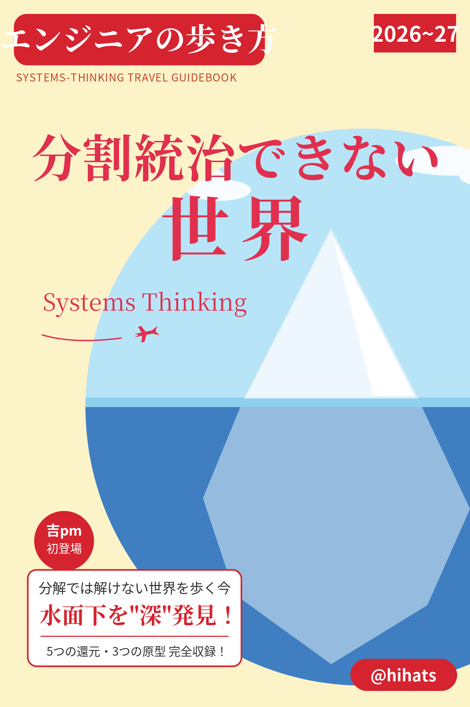

## 自己紹介

- name: @hihats
- job: ソフトウェアエンジニア（IC）, 過去は開発責任者、EM、技術顧問など
- from: 横浜市港北区
- 関心: ソフトウェア設計、システム思考
- 吉祥寺.pm: 初参加
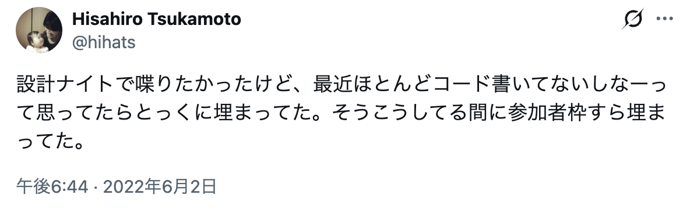

# §1 出来事

## 身近な例（分散モノリス ＆ 人月の神話）

::::c
:::_
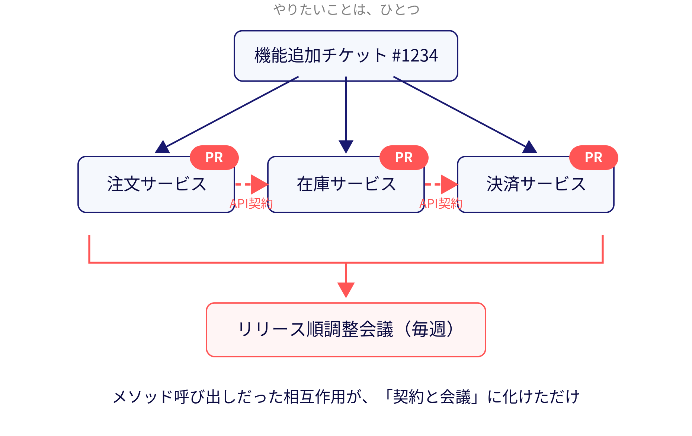
:::

:::_
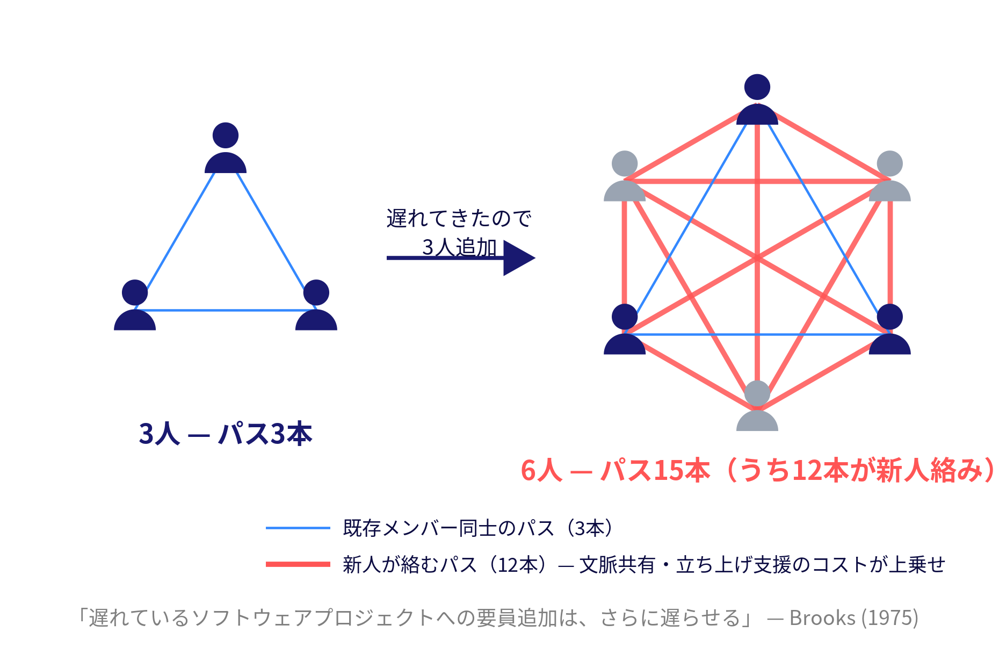
:::
::::

<!-- 時間次第で復活: Marp上は非表示
## ③ リファクタリング期間で負債を返したのに、半年後には元通り
_class: nolead
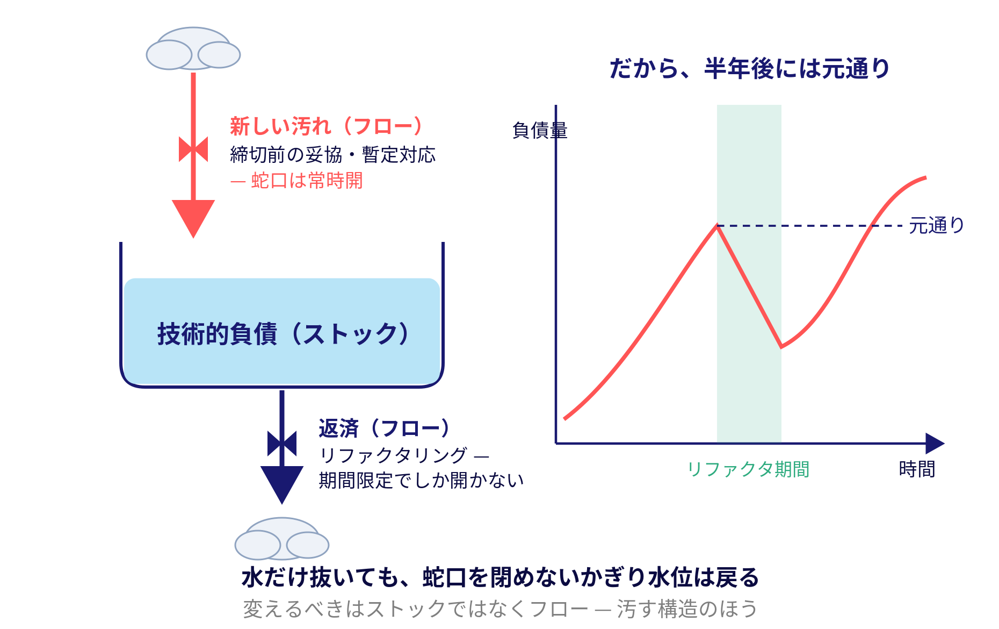
-->

## プロダクト組織でも、プラットフォーム事業でも

::::c
:::_
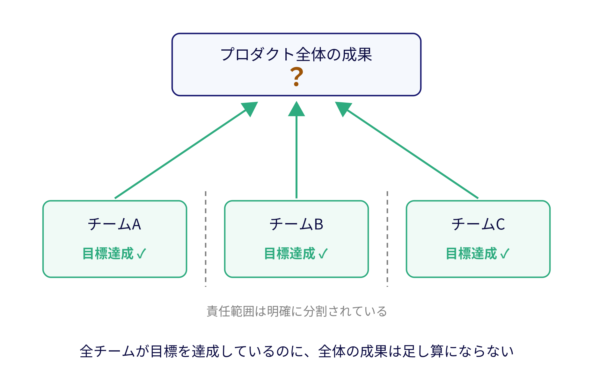
:::

:::_
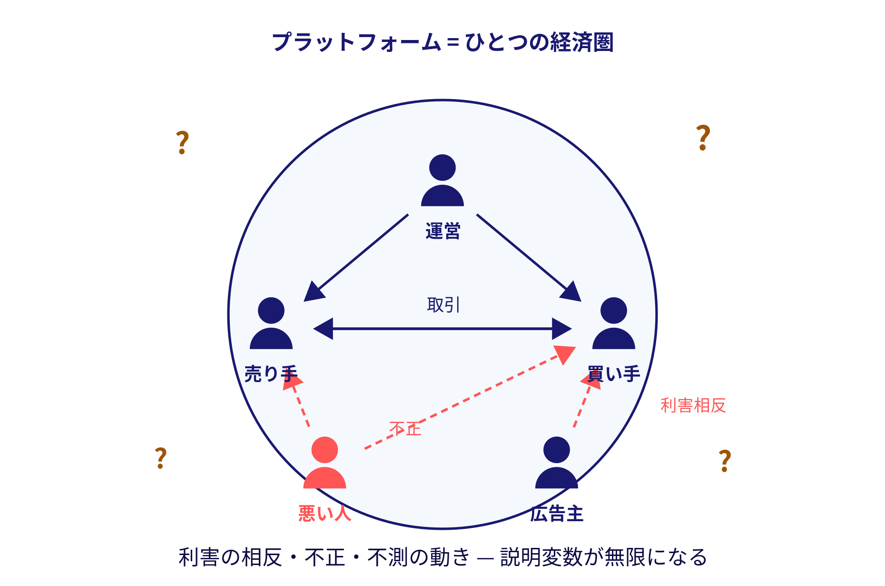
:::
::::

## 開発責任者をやっていた頃に言われたこと

経営からのフィードバック

> **「開発はがんばっていると思うが、事業にどれだけ貢献しているか見えづらい」**

これに対する正直な気持ち

## でしょうね


<!-- _class: nolead -->

## 「開発組織の成果をどう見せるか」は、分割統治できない

<!-- _class: nolead -->

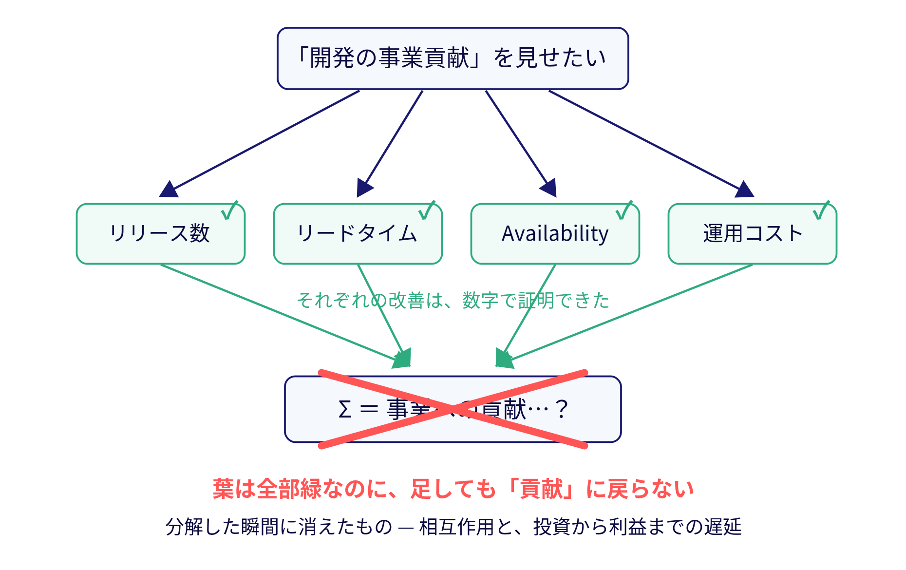

## とてもつらい

<!-- _class: nolead -->

何がつらいって、大きな問題は分割することでなんとかしてきた人生だった。

## Divide and Conquer（分割統治）

「大きな問題は、解ける大きさまで分割し、個別に解いて、統合する」

アルゴリズム設計から関心の分離・単一責任まで、エンジニアリングの土台にある思考の型

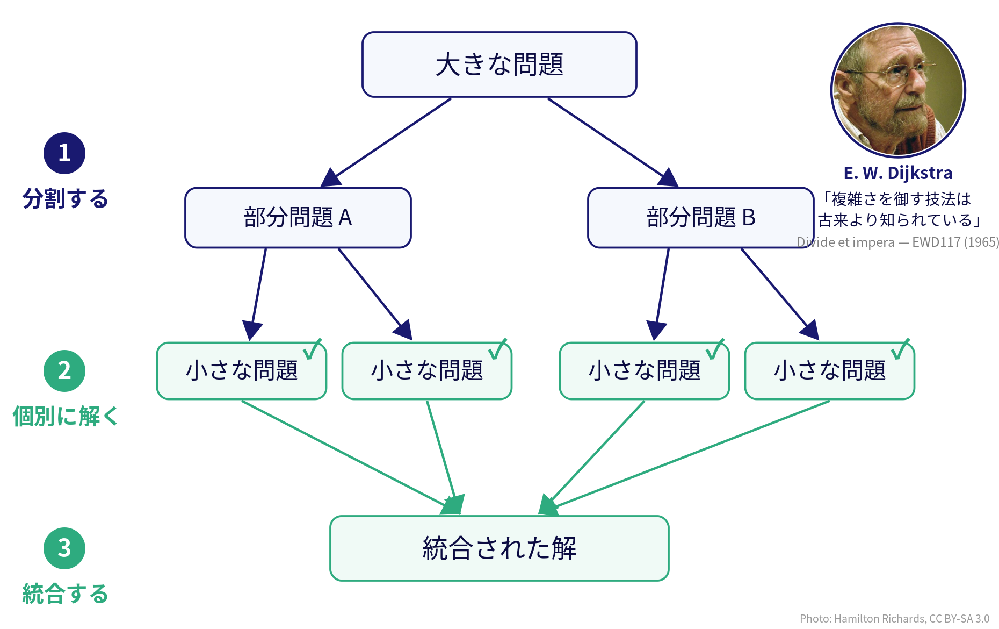

## 還元主義 — 400年の成功体験

分割統治の根っこにあるのが**還元主義**。「複雑な現象は、それを構成するより単純な要素に分解すれば理解・説明できる」という立場 — 分割統治は、そのソフトウェア工学における実装

近代科学の方法論そのものであり、**疑う理由がないほど、うまくいってきた**

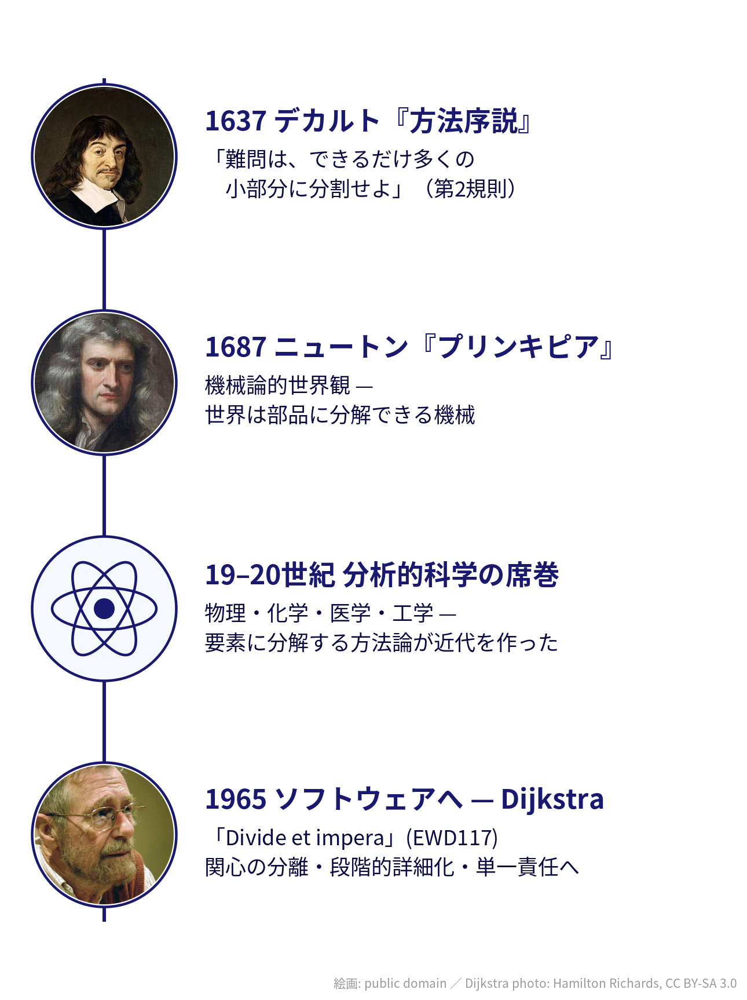


## システム思考とは

**要素そのものではなく、要素間の相互作用からシステム全体の振る舞いを理解する**考え方

- 分解して部分を調べる「分析」の、ちょうど対になる見方 — 関係・フィードバック・遅延に注目する
- 道具は因果ループ図、ストックとフロー、氷山モデルなど — 今日これから実物が全部登場する

身近な例は自然渋滞。全員がまともに運転していても、車間と速度の相互作用だけで渋滞は発生する — **誰も悪くないのに、全体として起きる**現象を扱う

## インデックス

| | セクション | 内容 |
|---|---|---|
| §1 | 出来事 | 「なんともならない」— 分割統治に嵌っている自分に気づく |
| §2 | パターン | 5つの還元が重なる症状 と、繰り返す3つの原型 |
| §3 | 構造 | 構造への介入 — 共にモデリングする3層 |
| §4 | メンタルモデル | 地形を知る — 自分のバイアスを外しにいく |
| §5 | 源流 | 70年繰り返されてきた知的系譜（時間次第） |
| §6 | まとめ | 持ち帰りと結論 |

## 歩き方の地図

いまのインデックスを、一枚の地図にしておく

システム思考の標準的な教え方である**氷山モデル**に沿って、水面から海底へ潜っていく

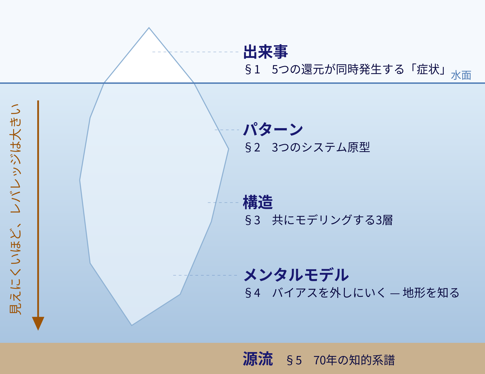

## システム思考を使って掘り下げていくと

- 開発側の説明不足？
- 経営側の認知の問題？

— どちらでもなく、**構造の問題** だとわかるし
もっと掘り下げると、自分の思考の型の限界だとわかってくる


## 言い換えると、構造の問題だということは、元々頭で分かってはいたりする
- 局所最適解はだめだよね〜
- 単一指標だけ追っていてもね〜
- オブジェクトだけじゃなく、インターフェースもちゃんと設計しようね〜


## が、本当の躓きはもっと奥に

- 局所最適がだめだと頭で分かっていても、実際には **問題を分解して解決するという局所最適の罠** にはまっていた
- これはエンジニアが得意とし、思考の習慣と化していた **「Divide and Conquer」≒ 還元主義** の限界を示していた
- （例）分解すると分解したものに名前をつける
  * 名前をつけると、その対象について理解した気になる
  * 「命名の誤謬（Nominal Fallacy）」という典型的な人間の認知バイアス

## 還元主義の問題を、還元主義で解こうとしていた
* 自分の思考パターンに気づくことから始めないといけない
* 自己認識とか嫌いなタイプだしどうしよう（後述）


# §2 パターン — 水面下に繰り返すもの

## 症状の正体: 5種類の還元が同時に重なっている

「接合できない」という症状は単一の問題ではなく、**異なる種類の還元が重なって表出している**

| 還元の種類 | 何を | 何に潰しているか | 理論的根拠 |
|---|---|---|---|
| 単一指標 | 多次元のシステム状態 | 一つの数値 | Montalion 12.1.1 |
| 線形因果 | 非線形な因果構造 | A→B→Cの直線 | Montalion 1章 |
| 部分最適 | 相互作用の産物 | 部分の足し算 | Simon/Meadows/Ackoff |
| 時間軸 | ストックの変化 | 今期のフロー | Meadows 2.6節 |
| サブシステム分離 | 社会と技術の相互依存 | 独立した二問題 | Trist 1951 |

## 出来事に個別対処しても、決まった形で再発する

一つひとつの出来事に対処しても、時系列で眺めると**同じ形で繰り返している** — システムダイナミクスの先人たちはこの繰り返しを**システム原型**として蓄積してきた

## 病例1: うまくいかない解決策（Fixes that Fail）

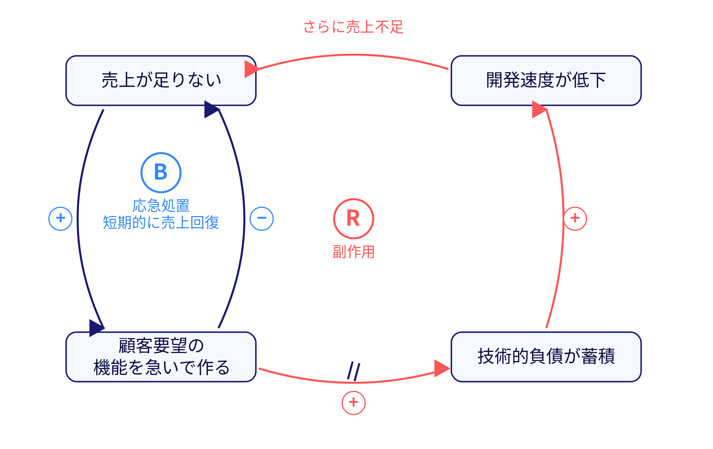

応急処置（B）が、遅延を挟んで副作用（R）を育てる

「今期の売上貢献」で測ること自体がシステムを壊している

## 病例2: 負荷の転嫁（Shifting the Burden）

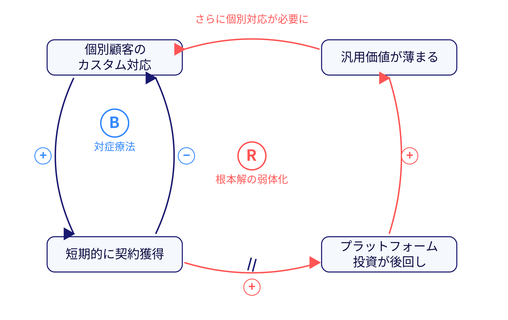

開発組織がSI的体質から抜け出せない構造

本当の介入は **配分ルールというシステム構造そのものの設計**

## 病例3: 成功者はさらに成功する（Success to the Successful）

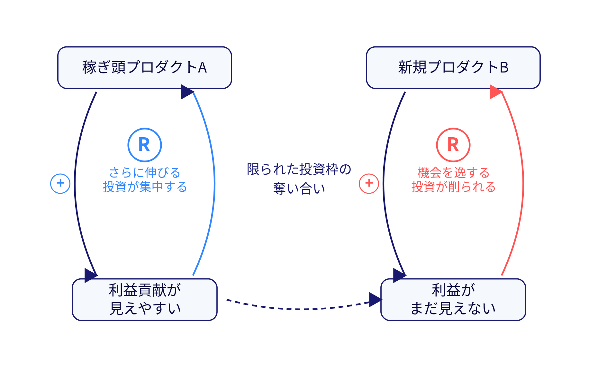

「利益が見えるものに投資する」という一見合理的なルールが——

**イノベーションのジレンマを構造として生産している**

## 3つの原型に共通する核

> **「利益」という指標の時間軸が短すぎる**ことが、すべてのループを駆動している

時間軸の還元（=還元4）が、3つの病例すべての発火点になっている

# §3 構造 — パターンを生み出しているもの

## 分析ではなく、モデリング

パターンの下には、それを生み続ける「構造」がある。構造への介入に必要なのは、正しい分析ではない

> 欠けていたのはモデルではなかった。  
> 欠けていたのは、**共同でモデリングする意欲と能力**であった。  
> — Diana Montalion『システム思考の世界へ』10.1.1


## 処方は3層構造

```
層3: 組織的な場の設計   （誰と誰が、何について対話するか）
        ↑ を支えるのが
層2: 可視化の技法       （CLD、氷山モデル、TDE）
        ↑ を支えるのが
層1: 思考の作法         （システム的論拠付け、4つのコアスキル）
```

**層2の道具だけ持ち込んでも機能しない** — 層1と層3が伴って初めて働く

## 層1: 思考の作法 — システム的論拠付け

可視化ツールではなく **思考の共同実践**

> 主張を支持することが目的ではない。**それを検証することが目的だ。**

論拠を強化する4つの特性

| 特性 | 問い |
|---|---|
| 信頼性 | 論拠は真実か？ |
| 関連性 | 論拠は状況に深く関連しているか？ |
| 一貫性 | 論拠は説得力のある全体を形成しているか？ |
| 説得力 | 自分の考えをより明確かつ納得できるものにできるか？ |

## 層1のツール: TDE（Top-Down Elaboration）

提案を構造化する1ページのフレームワーク

| セクション | 問い |
|---|---|
| 要約 | 何を提案するか |
| WHY | なぜそれが重要か（システムの目的との接続） |
| WHAT | 具体的に何をするか |
| WHO | 誰が影響を受け、誰が実行するか |
| HOW | どのように実行するか |
| WHEN | いつまでに何が起きるか |

**自分の主張をTDEで構造化して論拠を検証する** — 4つのコアスキル: 傾聴・熟考・論拠と向き合う・論理的誤謬を見抜く

## 層2: 可視化の技法 — CLDワークショップ

参考: LeSS / Scriptapedia (Group Model Building) / Change Agent

1. 問いを立てる — 「なぜ開発投資が利益に変換されないのか？」
2. 変数の洗い出し — 各人が付箋に変数を書く
3. 因果の矢印を描く — 同方向(+)/逆方向(-)をマーク
4. ループの発見と命名 — 強化型(R)と調整型(B)
5. 前提の表面化 — 「我々は何を仮定しているか？」
6. 介入ポイントの議論 — どこに介入すれば構造が変わるか？

## 層2の核心原則

<!-- _class: nolead -->

> **「ダイアグラムは副産物であり、対話が成果物である」**  — LeSS

正確な図を作ることが目的ではない。  
**図を描くプロセスで互いの限定合理性の壁が可視化される**ことが目的

## 層2の補助線 — 氷山モデル、再び

このトークの背骨に使っている氷山モデルは、そのまま**対話の道具**になる

```
見えるもの: 出来事       （バグ、売上低下）
   ↓ 長期的にどんな傾向があるか？
パターンと傾向
   ↓ これらはどう関連しているか？
構造
   ↓ どんな価値観・信念が形作っているか？
見えないもの: メンタルモデル
```

CLDで「構造」、対話で「メンタルモデル」を扱える状態にする — その最下層こそ、次の§4で潜る場所

## 層3: 組織的な場の設計 — クロスファンクショナル統合

開発投資→利益の文脈に翻訳

| 統合的洞察を生む問い | 開発側 | 事業側 | テクノロジー |
|---|---|---|---|
| 情報の流れ | エンジニアリング | 経営企画 | ダッシュボード |
| 収益との接続 | プロダクト/アーキテクト | 営業/財務 | 利用分析 |
| 遅延構造 | 開発マネージャー | 事業企画/CS | デプロイ頻度 |

> 提言は**クロスファンクショナルなグループによってモデル化されない限り**、システム思考を表したものにはならない

## 概念的な橋が架けられているかの判定

| 強いフィードバックループ（橋あり） | 弱いフィードバックループ（橋なし） |
|---|---|
| 積極的なコミュニケーション | 反応的なコミュニケーション |
| エコシステムの各部分が似た感触 | 不必要に異なっている |
| トレードオフが適切に行われる | 責任のなすり合い |
| 透明性が標準 | 「知る必要がある人だけ」に制限 |

# §4 メンタルモデル — 氷山の最深部

## 構造が見えて処方は出揃った

3層の道具があれば「構造」までは介入できる

だが氷山にはもう一段下がある。構造を形作っている価値観・信念 — **メンタルモデル**

ここから先は、経営でも組織でもなく、**自分自身の**話

## 20年前、バルセロナのホテルのエレベーターで

Simon Wardley（後のWardley Map考案者）の回想 — 経営幹部から戦略書類を渡され「この戦略に意味があると思うか？」と問われた

> 見慣れた言葉や図があったからこそ、私は「大丈夫そうですよ」と自信を持って答えました

「イノベーション」「効率」「アライメント」— 有名人がカンファレンスで重要だと言っていた単語が、そこでも強調されていたから

10年後にCEOになった彼は、戦略を評価する手段を自分が何も持っていないことに気づく

> 成功、利益、大胆な発言、自信に満ちた外見にみんなが疑惑を抱いたとき、報いを受けなければなりません

しかも事業は好調だった。**うまくいっている間は、うまくいっていない部分に気づけない**

## テミストクレスのSWOT

紀元前480年のテルモピュライ。テミストクレスは地形を読み、4,000人余りで17万のペルシャ軍を数日間食い止めた

もし彼が地形ではなくフレームワークを掲げていたら

> **「私にはSWOTがある。恐れる必要はない！」**

戦いで必須なのは**状況認識**（地形）か、それらしいフレームワークか — Wardleyはこの問いで、自分が地図を持たずに経営していたことを突きつけられた

## 盤面を見ずにチェスをする世界

Wardleyの思考実験 — 誰も盤面を見たことがなく、押した駒の記録（シーケンス）だけで戦う世界。やがて勝ち手順集『クイーンの秘密』がベストセラーになり、みんながコピーする

**盤面が見える相手には、必ず負ける**

## 盤面の見えない世界と、見えている世界

<!-- _class: nolead -->

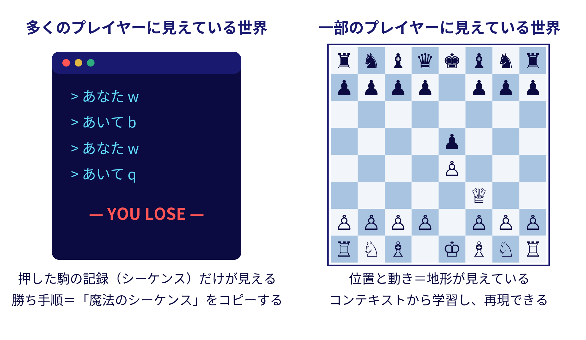

## 私じゃんね

「開発の貢献が見えづらい」と言われた私が持ち出したのは、それらしいKPIツリーと線形の説明資料だった

見慣れたフォーマットを並べて「大丈夫そうですよ」と言い合う — **エレベーターの中のWardleyと同じことをしていた**

## 限定合理性の正体

限定合理性とは、**各部門が盤面を見ずに自分の駒だけを動かしている状態**のこと

そして自分もまた、システム全体という盤面を見ずに「開発」の駒だけを動かしていた

## 「地図」と呼べるものの条件

自分も盤面を見ずに駒を動かしていたなら、次に要るのは「盤面の見方」— 何を「地図」と呼んでいいのかを知ることだった

Wardleyが挙げる地図の基本要素

| 要素 | 意味 |
|---|---|
| 視覚的な表現 | 物語ではなく絵で示す |
| コンテキスト固有 | 目の前の戦いに固有 |
| 位置とアンカー | 何に対する位置かの基準がある |
| 動き | 物事がどこへ動けるか・動いているかを示す |

私たちが戦略資料と呼ぶものの多くは、**「動き」か「アンカー」が欠けた図**であって、地図ではない。KPIツリーもロードマップもそう

## すでに地図を2枚描いていた

| 地図 | 何の地形を描くか | 見えるようになるもの |
|---|---|---|
| 因果ループ図（CLD） | 因果の地形 | 遅延、フィードバック、増幅 |
| 氷山モデル | 深さの地形 | 可視性とレバレッジの反比例 |

システム思考の道具とは、**分割統治できない世界の地図**だった

（地形の実体とは、ニーズとケイパビリティの連鎖を、Genesis→Custom→Product→Commodityという進化度の軸で位置づけたもの。位置と動きを最初から備えたこの「進化の地形図」= Wardley Map は、この先に学ぶ価値がある — 今日は入口まで）

## 目的のなぜ、行動のなぜ

「開発は事業に貢献せよ」— これは**目的のなぜ**しか語っていない

なぜ「あっち」ではなく「こっち」に投資するのか（**行動のなぜ**）は、同じ地形が見えていて初めて語れる

「利益との接合を証明する」のではなく、**同じ地図を見て行動のなぜを共有する** — §3の共同モデリングが果たしていたのは、実はこれだった

## 地形が見えないと、指針と指揮を混同する

- **指針**: コンテキストによらず効く普遍的な方法（ライフルの撃ち方）
- **指揮**: 目の前の地形に固有の判断（どこで戦うか）

地形が見えないまま成功事例をコピーするのは、**サイコロで6が出た人を称えて6に賭け続ける**こと（成果バイアス）

DDD・マイクロサービス・Four Keys の盲目的導入 — 「マクロの話をミクロに安易に当てはめる」問題の正体は、この混同

## 最深部にあったもの — いかに偏見を取り除くか

地形が見えなかった最大の理由は、道具の不足ではなかった

**この仕事によって、頭の中が凝り固まっていることを自覚する**

- 「働くなら会社で働くのが当然」
- 「価値は金額で生産するのが当然」

— 当然すぎて疑ったことすらない前提。「分解すれば理解できるはず」（還元主義）も、この列に並んでいた

## バイアスは、フィードバックを受ける仕組みにして外しにいく

自分のバイアスは、内省だけでは見えない（見えないから、バイアス）

**フィードバックを受ける仕組みを作って、それを外しにいく** — §3の共同モデリングは、まさにこの仕組みだった。自分の地図を他者に晒したとき、初めて自分の凝り固まりが照らされる

## 分割統治できない世界の歩き方

**地形を知り、地図を描く。そして、フィードバックを受ける仕組みで自分のバイアスを外しにいく**

描いた地図も、バイアスごと疑い続ける

あのとき失った自信は、能力の問題ではなかった。**地図を持っていなかっただけ** — だから、取り戻せる

> すべてのモデルは間違っていますが、なかには有用なものもあるのです — Wardley Maps 第1章

# §5 源流 — 知的系譜

## Diana Montalion — 立っている地面を知る

§4では空間の地形を知る話をした。最後は**時間の地形** — Montalionの議論は、ソフトウェア領域に閉じない長い系譜の延長線上にある

ここからは、エンジニアとして自分が立っている地面の深さを知るパートとする  
（時間が押せば飛ばす）

## システム思考の系譜

| 世代 | 人物 | 基盤 | 適用先 |
|---|---|---|---|
| 源流 | Bertalanffy / Forrester | 一般システム理論、システムダイナミクス | 理論の創出 |
| 第1世代 | **Weinberg**（1975〜）/ **Meadows** | GSTの応用 | Weinberg→ソフトウェア・人間系<br>Meadows→生態・経済系 |
| 第2世代 | **Montalion**（2026） | 上記の統合 | ソフトウェア組織のソシオテクニカルシステム |

Montalionの本にはWeinbergへの言及もあり、系譜は明示的に繋がっている

## Weinberg — ソフトウェア領域でのシステム思考の先駆者

**ジェラルド・M・ワインバーグ（1933-2018）**

- 『一般システム思考入門』(1975) — GSTのソフトウェア応用
- 『Quality Software Management Vol.1: Systems Thinking』(1992) — タイトルそのものが "Systems Thinking"

ソフトウェア組織における非線形効果を**因果ループ図で分析した最初期の体系**

## Weinberg: ラズベリージャムの法則

> **広げれば広げるほど薄くなる** — 『コンサルタントの秘密』

「負荷の転嫁」アーキタイプ（個別顧客対応が拡大するほど、汎用的な価値提供が薄まる）と同構造

エンジニアが「あれもこれも」の投資分散を許容する瞬間に発火する

## Weinberg: 真実のサーモクライン

**情報が組織の上層に上がるほど劣化する**現象

メドウズの電力メーター比喩（地下→玄関）が「物理的な可視性」の問題なのに対し、サーモクラインは「**組織階層による情報の劣化**」の問題

両方が同時に作用している

## Ackoff — 「そもそも分けるな」

**ラッセル・L・アコフ（1919-2009）**

最も過激な立場: **そもそも部分に分けて最適化すること自体がシステムを壊す**

| 概念 | 中身 |
|---|---|
| メス vs 問題 | 現実は相互作用する問題群（メス）。単一の問題を取り出すこと自体が破壊 |
| 「正しくやる」vs「正しいことをやる」 | 効率の追求 ≠ 有効性の達成 |
| 合成的思考 | 「これは何の一部か？」と問う（分析の逆） |
| 理想化設計 | ゼロからやり直すなら何を作るか、を共同で設計 |

## Ackoffの示唆 — 開発責任者にとっての意味

「利益は単一指標である」← Montalion 12.1.1  
「単一指標で測ること自体が破壊行為」← Ackoffのメス概念

エンジニアの実務への翻訳

- 「KPIを増やせばよい」ではない（指標の足し算は還元主義の継続）
- **メスとして扱う** = 関係者と「何を見るか」自体を共同で設計する

## ソシオテクニカル理論 — 「接合」問題の最も直接的な理論

**Tavistock研究所、Trist & Bamforth, 1951**

英国炭鉱で新技術を導入したら**生産性と士気が低下した**  
原因: 技術システムに合わせて社会システム（チームの自律性、職人的アイデンティティ）を破壊したこと

**共同最適化（Joint Optimization）** — 一方だけを最適化すると全体が劣化する

## ソシオテクニカル理論のソフトウェアへの再来

| 年 | 人物 | 概念 |
|---|---|---|
| 1951 | Trist & Bamforth | ソシオテクニカルシステム理論（炭鉱事例） |
| 1968 | Conway | **Conwayの法則** — 組織はそのコミュニケーション構造のコピーを設計する |
| 2019 | Skelton & Pais | **Team Topologies** — チーム構造とソフトウェアアーキテクチャの共同設計 |

我々が日々向き合っている「チーム編成」「アーキテクチャ」「組織設計」の問題は、**70年前から繰り返されている同じシステム問題**

## システム思考と還元主義の関係 — 立場の整理

| 論者 | 立場 |
|---|---|
| Ackoff | 還元主義は根本的に不十分。合成的思考で**置き換える** |
| Meadows / Montalion | 還元主義は有用だが、それだけでは足りない（**補完** の立場） |
| Weinberg | 対象に応じた**使い分け**（小さなシステムには分析、大きなシステムにはシステム思考） |

共通: **要素間の相互作用が弱い対象**には還元主義が極めて有効。  
**相互作用が支配的な対象**（組織、生態系、経済、ソフトウェアシステム）には不十分

## 還元主義 vs システム思考 — 4軸の対比

| 還元主義 | システム思考 |
|---|---|
| 分解して理解する | **関係の中で**理解する |
| 部分の性質を調べる | **相互作用のパターン**を観察する |
| 一人の分析者が客観的に | **複数の視点**で共同的に |
| 静的なスナップショット | **時間軸上の振る舞い**として |

エンジニアの仕事には**どちらも必要**。境界線を見極められるかが分岐点

# §6 まとめ

## 思えば底が変わったときが、一番の成長の機会だった


「貢献が見えない」という水面の出来事から潜り、パターン → 構造 → メンタルモデルまでを認識したところで、一番深い場所にある、**自分のバイアス** が邪魔していると何も変わらないことがわかる


## 注意: 還元主義は悪ではない

相互作用が支配的な対象（組織、事業、ソシオテクニカルシステム）では、**相互作用を捨象した時点で本質を見失う** — 主張したいのは「脱却」ではなく**分割統治や還元主義の「適用範囲の認識」**

- 引き続きエンジニアにとって必須の素養。「知らずのうちに固執していないか」に気づけるかが第一歩
- 還元主義に限らず、自分のエンジニアとして成功体験に縛られていないか — を自問する習慣

## 習慣づける？いやいや
* それができれば苦労しないのよ
* 習慣的にメンタルモデルを自問するなんて修行僧ですか
* 自分一人では無理

## 相棒を得ました


## 変わらないことは？
* ヘルシーでいましょう
*     まず健康　あとは何とか　なるものさ


## 参考文献（第1部）

- Diana Montalion『システム思考の世界へ』O'Reilly Japan, 2026 — 1章 / 7章 / 8.5節 / 10.1.1 / 12.1.1
- ドネラ・H・メドウズ『世界はシステムで動く』英治出版 — 2.6節, 12のレバレッジポイント
- ハーバート・A・サイモン『システムの科学』— 限定合理性
- Gerald M. Weinberg『一般システム思考入門』(1975) / 『Quality Software Management Vol.1: Systems Thinking』(1992) / 『コンサルタントの秘密』
- Russell L. Ackoff『Ackoff's Best』(1999) / 『Redesigning the Future』(1974)

## 参考文献（第2部）

- Simon Wardley, *Wardley Maps* 第1章「迷子」— kdmsnr 訳: [https://note.com/kdmsnr/n/n30ea0659cb54](https://note.com/kdmsnr/n/n30ea0659cb54) （CC BY-SA 4.0）
- Eric Trist & Ken Bamforth, "Some Social and Psychological Consequences of the Longwall Method of Coal-Getting", 1951
- Matthew Skelton & Manuel Pais『Team Topologies』IT Revolution Press, 2019
- LeSS Principles: Systems Thinking — [https://less.works/less/principles/systems-thinking](https://less.works/less/principles/systems-thinking)
- Scriptapedia (Group Model Building) — [https://en.wikibooks.org/wiki/Scriptapedia](https://en.wikibooks.org/wiki/Scriptapedia)
- Change Agent: 因果ループ図 — [https://www.change-agent.jp/systemsthinking/tools/causal_loop_diagram.html](https://www.change-agent.jp/systemsthinking/tools/causal_loop_diagram.html)

## ご清聴ありがとうございました

Q&A


