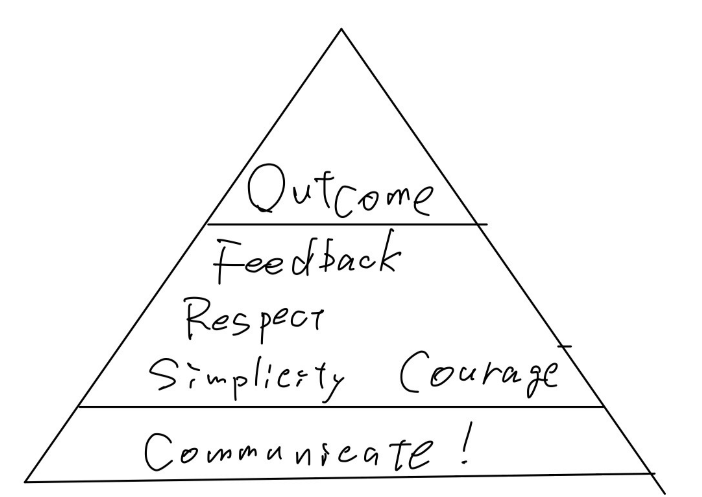
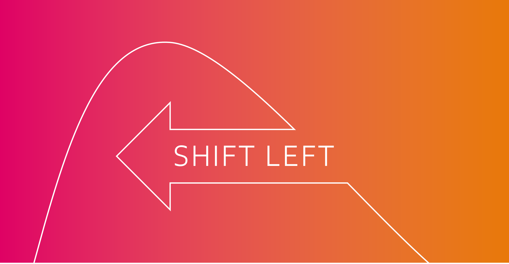
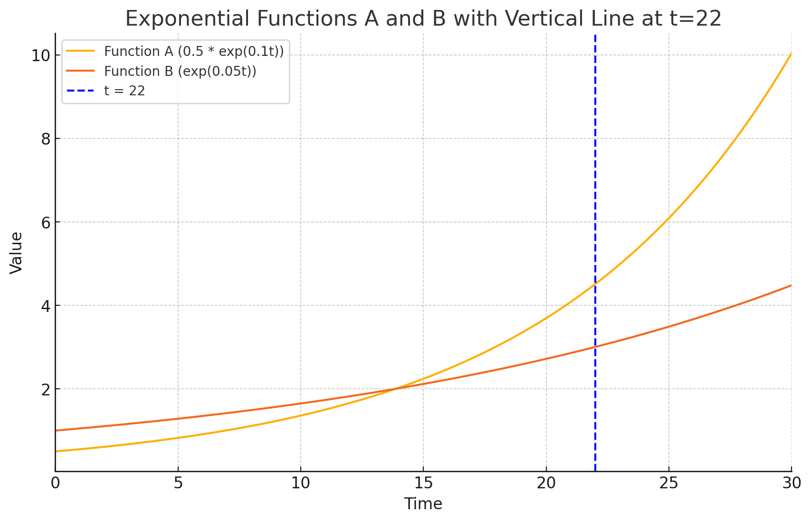

<!-- _class: lead -->
# エンジニアリングポリシーDraft

## Index
1. 目的
2. ソフトウェアエンジニアとは
3. 価値
4. 原則

## 目的
チームがより高い品質のソフトウェアを生み出せるようになり、より楽しくストレスレスに仕事を進められ、仕事の充実が生活の充実に繋がるようにする

## 目的
### 前提

この目的には **「高品質のソフトウェアをより短い時間で生み出すことが事業成果と社会的価値の両方を生む」** という前提条件があるものとする

## このポリシーの想定適用ケースと効果
- 日々の開発の中で意見が分かれたり、判断に困ったときに価値や原則に立ち返る
* **よいポリシーはよい制約をもたらし**、よい制約は認知負荷を軽減してくれる
* 行動の明確化に繋がらないポリシーはよいポリシーとは呼べないので適宜取捨が必要

## ソフトウェアエンジニアとは

ソフトウェアエンジニアとして心がけることを知る前に、ソフトウェアエンジニアたるものが社会においてどういう存在かを知る
<!-- _class: caption -->

## ソフトウェアエンジニアとは

> *社会全般において中心的な役割を拡大しているソフトウェアシステムの分析、仕様策定、設計、開発、認証、メンテナンス、およびテスト*に直接的に関与および、その指導を行うことによって貢献する専門家である。 

> そのようなソフトウェアシステムを開発する役割を担っているソフトウェアエンジニアには、善をなすことも害をなすこともできる多大なる機会がありまた、他者が善をなすことも害をなすことも可能にする大きな機会がある。

> 自分たちの努力ができる限り善のために使われるよう、ソフトウェアエンジニアを**社会にとって有益で尊敬される職業にすることを約束しなければならない**。（ACM and IEEE）

[SoftwareEngineeringCodeofEthicsandProfessionalPractice.pdf](attachment:51b683d9-bf93-4405-bd4b-231b668ab48d:SoftwareEngineeringCodeofEthicsandProfessionalPractice.pdf)

---
<!-- _header: ソフトウェアエンジニアとは -->
> - 保守性、拡張性、ビジネス価値を考慮しながらソフトウェアを通じて問題を解決する専門家である（Martin Fowler）
> - 技術的知識とエンジニアリングの原則を組み合わせて信頼性の高いソフトウェア・システムを構築する実務家である（Steve MacConnell）

これらは社会におけるこの職種のあるべき姿（ToBe）と言える

→ これを念頭において、価値と原則を定義していく

## 価値（Value）

エンジニアとして価値をおく（⼤切にする）こと
<!-- _class: caption -->

## 価値（Value）
<!-- header: 価値 -->

### Growth Target
  - Outcome（成果）

### Be Agile
  - Feedback
  - Respect
  - Simplicity
  - Courage

### One Crowdworks
- Communicate!（デンタツしよう！）

---
価値は上位が優先される

## Outcome
プロダクトにおける成果が何かをプロダクト全員で共通認識をもち、成果を突き詰める

---
### Be Agile
#### Feedback
* 変化に対応するには、フィードバックを受けれる仕組みになっていることが必要条件である
* そのフィードバックサイクルは短ければ短いほどよい

---
### Be Agile
#### Respect
* ここで言う「他者への尊敬」とは、倫理的な意味を指してはいない
* ソフトウェア開発における成果を上げるには**関係する個人に対するリスペクトなしには不可能である** という点でRespectに価値を置く

---
### Be Agile
#### Simplicity
* ほとんどのケースにおいて、シンプルさは正義である
* ソフトウェアによってできることが増えてくるにつれて、ソフトウェアをシンプルにできないことのほうが多くなっているが、 **よりシンプルに作れないかの追求を止めないこと、複雑性をどこに押し込めるかを考え抜くこと** に価値をおく

---
### Be Agile
#### Courage
* 勇気は他の価値を補佐する価値である
* **他の価値を毀損する恐れを感じたとき**は勇気をもって公開すること

## One Crowdworks
### Communicate!（デンタツしよう！）
* 良いアイデアも、効果的な仕組みも、大いなる成果も、すべて影響範囲を広げることで価値が増幅される
* 他者やチーム外にデンタツする行為を軽視しない

## 原則

価値を生むための振る舞いの指針となるのが原則
<!-- _class: caption -->
<!-- header: 原則 -->

## 原則
### 品質に誇りと責任をもつ
### 技術者倫理に基づく
### 時間効率性を求める
### 全体の最大利益を求める

---
### 品質に誇りと責任をもつ

#### そもそもソフトウェア開発における品質とは
ソフトウェア品質知識体系（SQuBOK）における
- 機能適合性
- パフォーマンス
- ユーザビリティ
- 信頼性
- セキュリティ
- 保守性

を**特に重視**する（※プロダクト特性によって順序は前後し、互換性や移植性が入ってくることもある）

---

あわせてシフトレフトの考え方も原則に入る
（機能適合性がいい例だが、品質を満たすための複雑さは増してきており、エンジニア以外といかに、**早く**協力するか）

---
### 技術者倫理に基づく
- 公衆の安全
- 社会ルール
- 他者の権利の尊重
- 契約の遵守
- 職務を誠実に遂行

---
### 時間効率性を求める
ソフトウェアエンジニアリングとは時間で積分したプログラミングであり、プロダクトを持続させる上で成果を最大化させる必要がある

## 原則
### 全体の最大利益性を求める
- ユーザー
- チーム
- ステークホルダー

すべての相互利益の最大化を追求しなければならない

## その他（入れ方が固まっていない）
<!-- header: "" -->

- エンジニアにとって知識は資産であり、学習活動は仕入れ
- プラグマティズムは「理想は捨てず」に、「現実的な制約の中で最適な解決策を見つける」ということを意味する

- 細かい業務工程部分
  * プログラミング
  * 設計
  * 開発ツール
  * 開発プロセス
  * テスト

* すべてはトレードオフである
  * 何を犠牲にして、何を優先したのかを記録しておく

- アンチハラスメントポリシー（社内規定あるっけ）

## 必須能力
能力の有無はあくまでスキルや行動として表出しているかどうかでしか判断できない

何時間でも夢中になって作業したり調べたりできる対象 → 自分が楽しんでできること

## 必須能力
### 必須スキル
  - 技術スキル
  - 非技術スキル

# まとめ

## 成果にこだわる
- ポリシーがあってもなくても何も変わらないのでは意味がない
- チームが同じ方向を向いて、日々の仕事をよくしていくために活用しましょう

