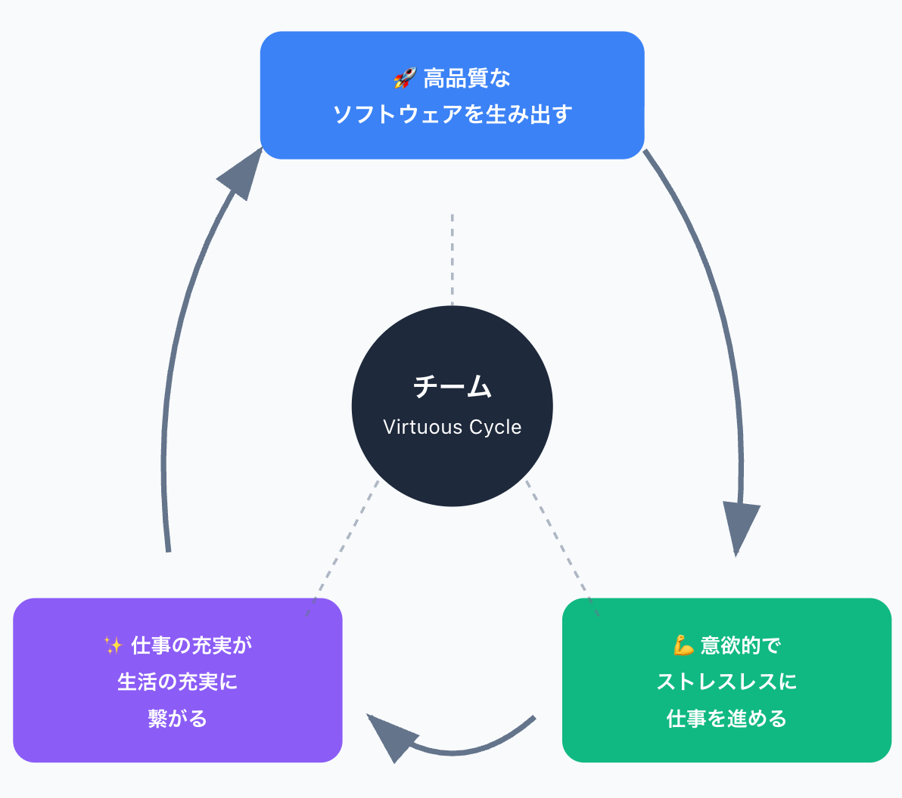

<!-- _class: lead -->
# エンジニアリングポリシー

## Index
1. 目的
2. ソフトウェアエンジニアとは
3. 価値
4. 原則
5. まとめ
6. Appendix

## 本ポリシーの目的（の前提）

この目的には **「高品質のソフトウェアをより短い時間で生み出すことが事業成果と社会的価値の両方を生む」** という前提条件があるものとする
（※ もしこの前提が崩れた場合は、目的自体の見直しが発生する）

## 本ポリシーの目的
チームが、より高い品質のソフトウェアを生み出せるようになり、より意欲的でストレスレスに仕事を進められ、仕事の充実が生活の充実に繋がり、それがまたよい仕事を生むという好循環を生み出すこと

## 本ポリシーの想定適用ケースと効果
### 想定適用ケース
- 日々の開発の中で意見が分かれたり、判断に困ったときに価値や原則に立ち返る
### 効果
- **よいポリシーはよい制約をもたらし**、よい制約は認知負荷を軽減してくれる
* 行動の明確化に繋がらないポリシーはよいポリシーとは呼べないので適宜取捨が必要

## ソフトウェアエンジニアとは

ソフトウェアエンジニアとして心がけることを知る前に、ソフトウェアエンジニアたるものが社会においてどういう存在かを揃える
<!-- _class: caption -->

## ソフトウェアエンジニアとは

> 社会全般において中心的な役割を拡大している*ソフトウェアシステムの分析、仕様策定、設計、開発、認証、メンテナンス、およびテスト*に**直接的に関与**および、**その指導**を行うことによって貢献する専門家である。 

> そのようなソフトウェアシステムを開発する役割を担っているソフトウェアエンジニアには、善をなすことも害をなすこともできる多大なる機会がありまた、他者が善をなすことも害をなすことも可能にする大きな機会がある。

> 自分たちの努力ができる限り善のために使われるよう、ソフトウェアエンジニアを**社会にとって有益で尊敬される職業にすることを約束しなければならない**。（ACM and IEEE）

[Software Engineering Code of Ethics and Professional Practice](https://dl.acm.org/doi/pdf/10.1145/265684.265699)

---
<!-- _header: ソフトウェアエンジニアとは -->
> - 保守性、拡張性、ビジネス価値を考慮しながらソフトウェアを通じて問題を解決する専門家である（Martin Fowler）
> - 技術的知識とエンジニアリングの原則を組み合わせて信頼性の高いソフトウェア・システムを構築する実務家である（Steve MacConnell）

#### 品質を高めることが、生産性やスピードを高めるということを知っている人であり、それを証明する人である

これらは社会における **この職種のあるべき姿（ToBe）** と言える

## Appendix
### エンジニアリングそのもの
- 「人や社会に役立つために体系立てられたもの」
- 対象生産物を生産するにあたって生産性の向上と品質の向上を目的とする
### 他の工学との差分
- 対象領域が時代ごとに拡大している
- 他の工学よりもさらに目に見えない領域が大きい

---
### ソフトウェアエンジニアの役割への補足
- チームがどういう職種のメンバーで構成されているかでエンジニアの求められる**役割**は多少変化する
  * 例えば、POが不在であればPRDを書く必要があったり、デザイナーがHTML/CSSを書けたりすれば画面コーディングをする必要がないなど
* そういった組織の状況に**依存しない普遍的**な定義が上の定義になっている

---
### この「ソフトウェアエンジニアとしてのToBe」へと続く道から外れずに[「目的」](#本ポリシーの目的)を成していくための **価値** と **原則** を定義していく

---

## 価値（Value）

エンジニアとして価値をおく（⼤切にする）こと
<!-- _class: caption -->

## 価値（Value）
<!-- header: 価値 -->

### Growth Target
  - Outcome（成果）

### Be Agile
  - Feedback
  - Respect
  - Simplicity
  - Courage

### One Crowdworks
- Communicate!（デンタツしよう！）

---
価値は上位が優先される

## Outcome
プロダクトにおける成果が何かをプロダクト全員で共通認識をもち、成果を突き詰めること

---
### Be Agile
#### Feedback
* 変化に対応するには、フィードバックを受けれる仕組みになっていることが必要条件である
* そのサイクルは短ければ短いほどよいので「フィードバックサイクルの短さが価値」である

---
### Be Agile
#### Respect
* ここで言う「他者への尊敬」とは、倫理的な意味を指してはいない
* ソフトウェア開発における成果を上げるには**関係する個人に対するリスペクトなしには不可能である** という法則に倣い、Respectに価値を置く

---
### Be Agile
#### Simplicity
- ほとんどのケースにおいて、シンプルさは正義である
* ソフトウェアによってできることが増えてくるにつれて、ソフトウェアをシンプルにできないことのほうが多くなっている
* それでも **「よりシンプルに作れないかの追求を止めないこと」「複雑性をどこに押し込めるかを考え抜くこと」** に価値をおく

---
### Be Agile
#### Courage
* 勇気は他の価値を補佐する価値である
* **他の価値を毀損する恐れを感じたとき**は勇気をもって公開すること

## One Crowdworks
### Communicate!（デンタツしよう！）
* 良いアイデアも、効果的な仕組みも、大いなる成果も、すべて影響範囲を広げることで価値が増幅される
* 他者やチーム外にデンタツする行為を軽視しない

## 原則

価値を生むための振る舞いの指針となるのが原則
<!-- _class: caption -->
<!-- header: 原則 -->

## 原則
- ### **品質**に誇りと責任をもつ
- ### **技術者倫理**に基づく
- ### **時間効率性**を求める
- ### ~~**全体の最大利益**を求める~~
- ### ~~リスクを理解しつつ、新しい技術やシステムに取り組める態度（批評家ではない）~~

## 品質に誇りと責任をもつ

（特に内部）品質に責任をもつ職業は**ソフトウェアエンジニア以外にいない**
つまり、**品質責任を負うことは我々の存在意義そのもの**である

---
### どういったときにどうやって原則を適用すべきか
#### 多くのケースでは、何かしらとのトレードオフで品質にかけるコストを削っている（無意識と無謬性から）
  1. ユーザーへのデリバリーを優先してテストを最小限にしたとき
      - その意思決定を**自覚的にチームとして行い記録として残す**
        * コードコメントでもよい（フロー情報として流れてしまうものはNG）
      * つまり「保守性を後回しにする」という意思決定をした！ということである
      * それによってどういうリスクがあるかをチームで言語化する
      * 自覚的に行っている以上、必然的に「いつ品質を取り戻す活動をするか」の話になる
  2. 逆のケースも然りで、保守性を優先してデリバリーを遅らせたなら、その意思決定を記録する
<!--  * 誇りの話 -->
---
  3. ドキュメントを書くべきかどうか
      * これも品質の観点で考える（**書くことが何の品質を高めるのか**）
        * ※ 保守性のケースもあるし、ユーザビリティのケースもある
      * それについてチームでコミュニケーションし、フィードバックを求める（上述の価値の部分）
  4. 特定の画面のレスポンスが遅くなっているとき
      * サービスレベルが定まっているのであれば既に品質判断基準があるということで、意思決定は迅速にできる
      * 理想としてはそうだが、そうなっていないことも多い。そのときどうする？
      * 最低限、その提供機能に求める水準を（PO交えて）決めること
      * **なんとなくで後回しにしない**（後回しにした根拠を形式知にする）

---

### シフトレフトの考え方も品質に関する原則に含まれる
品質を満たすための複雑さは増してきており、エンジニア以外といかに、**早く**協力するかが品質を大きく左右する（昨今だと機能適合性がとくに該当する）
- 施策やプロジェクトをふりかえるとき、必ず「もっとシフトレフトできなかったか」の観点でふりかえること

## Appendix ソフトウェア開発における品質とは
ソフトウェア品質知識体系（SQuBOK）における
- 機能適合性
- パフォーマンス
- ユーザビリティ
- 信頼性
- セキュリティ
- 保守性

を**特に重視**する（※プロダクト特性によって順序は前後し、互換性や移植性が入ってくることもある）

→ チームとして守るべき品質基準をもっているかもっていないか

## 技術者倫理に基づく

## 技術者倫理とは
- 公衆の安全の最優先
- 社会ルール（法令）遵守
- 他者の権利の尊重
- 契約の遵守
- 職務を誠実に遂行

---
### どういったときにどうやって原則を適用すべきか
#### 想定事例: 
あるプロダクトにはサードパーティ開発者向けに提供していたAPIがあり、最重要KPIは「プロダクトの成長」と「開発者エコシステムの拡大」であった。エンジニアリングチームは、外部開発者がどんどんAPI利用を拡充したくなるようなAPIの設計を求められていた。

そのため、APIは本質的に寛容で、悪用されやすい機能を持つような設計になっており、プライベートなメッセージのやりとりも連絡相手との同意なく取得できていた。「外部開発者とその関係者がAPIで取得したデータを広告に利用するなどが可能なこと」に、チームは薄々気づいていたが、API及びエコシステムの利用拡大が進んでいる状況のため即座の対応を先送りにした。

---

**「Move Fast and Break Things」（素早く動き、破壊せよ）** は、初期のスローガンで、迅速な開発とイノベーションを奨励するカルチャーを醸成するためだった。

迅速な機能のリリースを優先し、完璧でなくてもまずは市場に出して改善していくという考え方を浸透させたが、後に **「Move Fast with a Stable Infrastructure」（安定したインフラで素早く動け）** へと変更された。

<!--
「いや、そんなんやらんやろ」と思うかもしれない
「成長がすべて」と言われたときに本当に抗えますか？
抗えるのが技術者の矜持
かつ、根拠を示せるのが技術に責任をもつということ
-->

## 時間効率性を追求する

---
#### ソフトウェアエンジニアリングとは時間で積分したプログラミングであり、プロダクトを持続させる上で成果を最大化させる必要がある

---
### どういったときにどうやって原則を適用すべきか
#### 何かを開発するとき、そこには必ずゴール（目的）がある
- 【前提】プロダクト開発には、短期的（e.g. 1ヶ月以内）で成果が出るものはあんまり無い（まれにある）
- 【前提】作ったものが、時間の経過とともに成果が出なくなることは**通常である**
- これから何かを開発することによって実際にどのくらいの期間でゴールを満たせるかわからないとき（もしくは定量的なゴールがまだ出せないとき）
  * 必要なことは、リリース直後だけでなく「1年〜3年単位でも成果を定点観測できる」想定で開発すること
  * その原則を守ることで、我々は結果的に時間効率性を意識した開発をすることができる
  * さもなくば、効果が無くなっているものをいつまでも面倒を見ることに、**貴重な時間を奪われ続ける**ことになる

<!--
## 原則
### 全体の最大利益性を求める
- ユーザー
- チーム
- ステークホルダー

すべての相互利益の最大化を追求しなければならない

### どういったときにどうやって原則を適用すべきか
- 
-->

# まとめ
## 原則
価値を生むための振る舞いの指針となるのが原則

- ### **品質**に誇りと責任をもつ
- ### **技術者倫理**に基づく
- ### **時間効率性**を追求する

## 第一義的には「成果にこだわる」がポリシー
- ポリシーがあってもなくても何も変わらないのでは意味がない
- チームが同じ方向を向いて、日々の仕事をよくしていくためにポリシーを活用しましょう

# Appendix
## Facebook事例の結果と影響

### 規制と処罰
- **記録的な罰金**: 米国FTCから50億ドルの罰金
- **国際的処罰**: 英国など他の法域でも罰金に直面
- **法的先例**: 2012年の同意審決違反に基づく処罰

---

### 組織構造の変更
- **独立委員会設置**: 取締役会に独立したプライバシー委員会
- **経営責任の明確化**: CEOザッカーバーグへの個人的責任
- **ガバナンス改革**: FTCとの和解による大幅な構造変更

### 社会的影響と変化
- **プライバシー意識の変革**: 一般市民と規制当局の態度変化
- **法制度への影響**: GDPR制定など世界的なプライバシー法整備
- **信頼失墜**: 時価総額1000億ドル以上の減少
- **テック企業への不信**: 大手プラットフォームに対する社会の信頼喪失

---

### 技術倫理への根本的影響

#### 事件の本質
- 伝統的な「侵害」ではなく **意図された機能の悪用**
- データ抽出ビジネスモデルから始まる因果関係

#### 技術的要因
- 成長促進のための**寛容なAPI設計**
- **プラットフォームガバナンスの軽視**
- グラフAPIによる開発者のデータ容易アクセス

---

#### エンジニアリング倫理の拡張
従来の技術的問い：
- 「これを構築できるか？」
- 「安全か？」

**新たな倫理的問い**：
- 「構築するものの社会的影響は何か？」
- 「影響を緩和する責任は何か？」

#### 認識の転換
- アルゴリズムとデータプラットフォームは**中立的ツールではない**
- 世論と行動を形成する**強力なシステム**
- 認識論的かつ民主的な危害の可能性
## その他（入れ方が固まっていない）
<!-- header: "" -->

- エンジニアにとって知識は資産であり、学習活動は仕入れ
- プラグマティズムは「理想は捨てず」に、「現実的な制約の中で最適な解決策を見つける」ということを意味する

- 細かい業務工程部分
  * プログラミング
  * 設計
  * 開発ツール
  * 開発プロセス
  * テスト

* すべてはトレードオフである
  * 何を犠牲にして、何を優先したのかを記録しておく

- アンチハラスメントポリシー（社内規定あるっけ）

## 必須能力
能力の有無はあくまでスキルや行動として表出しているかどうかでしか判断できない

何時間でも夢中になって作業したり調べたりできる対象 → 自分が楽しんでできること

## 必須能力
### 必須スキル
  - 技術スキル
  - 非技術スキル
