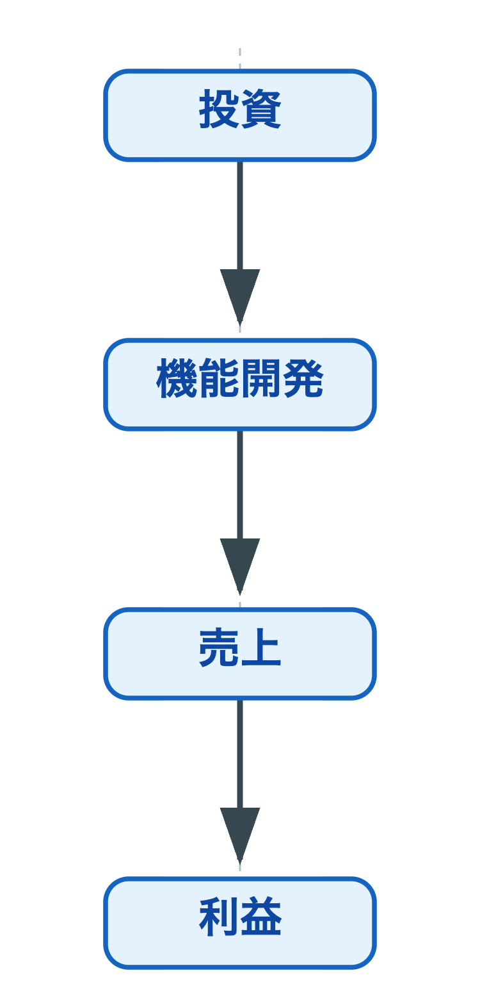
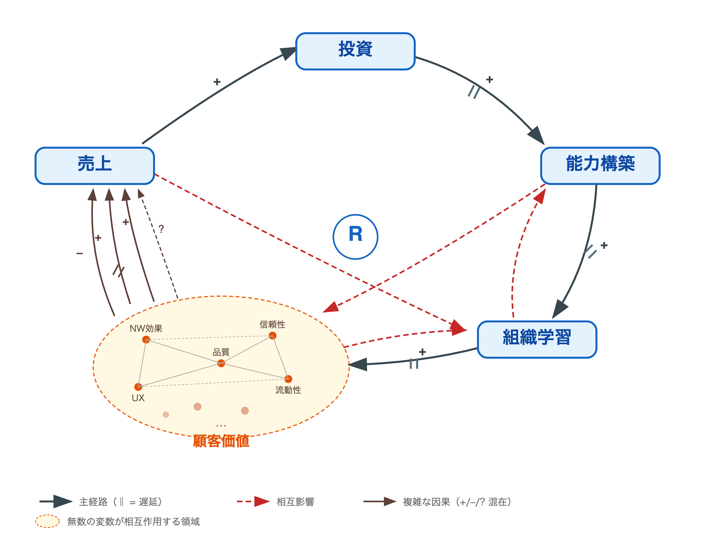

<!-- header: "" -->
<!-- _class: nolead -->
# エンジニアの基本的思考原理にある還元主義アプローチが適用できない世界

<!-- header: "#yokohamanorth" -->
## Index
1. 自己紹介
2. 還元主義とは
3. 問題提起
3. なぜ開発による事業貢献が可視化されづらいか — 構造を読み解く
4. ハマっていた罠
5. じゃあどうするのか
6. まとめ

## 自己紹介:
name: @hihats
address: 港北区
yokohamanorth: 3回目
job_description: ソフトウェアエンジニアのIC

## 還元主義とは

> 複雑な対象を部品に分解して個別に理解すれば、その合計で全体も理解できるとする思考の型

我々の仕事そのものであり、エンジニアに限らず、サイエンスを学ぶもの全てに通ずる考え方

## 開発責任者をやっていたときに「プロダクト開発と事業利益の接合点」について、苦労したこと
* 開発責任者をやっていると、経営からこういう評価をもらうことがある
* **「開発はがんばっていると思うが、事業にどれだけ貢献しているか見えづらい」**
* それに対して思うこと

## でしょうね

<!-- _class: nolead -->

## （当然事業モデルにもよるが）なぜ「貢献」が見えないのか
- 開発側の説明不足なのか？
- それとも見る側の認知の問題なのか？
- むしろ **構造の問題** ではないか
  * ここで役立つのがシステム思考
<!-- 過去、システム思考的なことを考えてきていたこともあり辿り着いた -->

## 因果の捉え方がそもそも違いそう

事業の執行者の（一般的な）思考パターン

## 開発の現実
プラットフォームビジネスにおける因果ループ図

## 投入と成果の因果が「時間的に切断」されている
- 各要素が相互に影響し合い、*遅延を伴う*自己強化ループを形成している
- **つまり、今期の投資を今期の利益で測ること自体に無理がある**
- だが、事業会社が半期単位での業績を度外視することのハードルはかなり高い

## いわゆる「線形思考 vs 非線形思考の衝突」っぽく見えていた
*プロダクト事業がそんなに単純なことではない* という理解はあっても、一瞬で求められる経営判断に時間をかけることが難しく、結果として線形的な思考になってしまいがち

## さらに状況を複雑にしていること
各部門が **自分の持ち場で「正しい」判断をしている** （と思っている）のに全体としての成果として現れない

- エンジニアはコード品質・アーキテクチャを最適化する
- マーケティングは顧客獲得を最適化する
- 不正利用対策チームはかなりの不正を撲滅している

## ハーバート・サイモンの「限定合理性」
**利益への影響や、相互の関連性が「見えない場所」にあることが問題の本質**

## ここまでは割と誰でも気づく

## 思考のもっと奥の方はこうなっていた
- 局所最適がだめだと頭では分かっていても、実際には問題を分解して解決するという局所最適の罠にはまっていた
- そしてこれはエンジニアが得意としていて、かつ思考の習慣と化していた **「Divide and Conquer」というアプローチ——≒還元主義** の限界を示していた
- この限界を理解しないまま開発と事業貢献を結びつけようとすると、問題はどんどん悪くなる

## もっと具体的には
- ここまでの問題
  - 多次元のシステム状態を単一指標に潰す
  - 全体の相互作用を無視して部分を最適化する
  - 時間軸を「今期」に潰す
- 問題はこれら自体ではなく、**「この問題を経営にどう伝えるか」を考えるとき、各パターンを分解して個別に説明しようとしていた** こと
- これはまさに罠そのものと同じ構造

## 還元主義の問題を、還元主義で解こうとしていた

## じゃあどうするのか — 還元主義からの転換
開発責任者の本当の仕事は「利益に貢献する機能を作ること」ではなく
**開発投資と利益の関係そのものをシステムとしてモデリングし、経営と共有すること**
> 欠けていたのはモデルではなかった。欠けていたのは、共同でモデリングする意欲と能力であった。
> — Diana Montalion『システム思考の世界へ』

### 大好きな個別のモジュール開発への関心を捨てる勇気がいる

---
### 「分析」はモデリングの前提であり、敵ではない
- 時系列相関やラグ分析は遅延構造を理解するための道具
- ただし分析結果を「個別の発見」として経営に提示すること ≠ 接合
- **分析はシステムモデルの根拠として組み込む**

---

### （参考）メドウズの介入ポイントで考えてみる

| やること | 内容 |
|---|---|
| **情報の流れを変える** | 開発投資が利益に変換されるまでの遅延構造を可視化し、経営と共有する。電力メーターを地下から玄関に出すのと同じ |
| **ルールを変える** | 評価期間を変える。「今期の売上貢献」ではなく「N期後の利益創出能力の変化」を指標に含める |
| **目的を変える** | 「利益を生む機能を作る部門」から「**事業が利益を生み続けるためのケイパビリティを構築する部門**」へ |

## 大事なことなので二回目
- 経営に「正しいモデル」を提示するのではない
- **経営と一緒にシステムをモデリングする場を設計する**
> 欠けていたのはモデルではなかった。欠けていたのは、共同でモデリングする意欲と能力であった。
> — Diana Montalion『システム思考の世界へ』

### 対話が成果物であり、正確な図を作ることが目的ではない

## まとめ
- 「開発投資が利益に繋がっているかわからない」は個人や部門の問題ではなく、構造の問題
- 罠の存在に気づくことと、それを経営と接合できることは別の話
- 接合しようとする行為自体が還元主義的だったことが本当の躓き
- 求められる転換は **分解ではなくモデリング — 経営と共にシステムの構造を理解する場を作ること**

## 注: 還元主義そのものを否定してはいない
- 引き続き、科学者やエンジニアにとって必須の素養であることは間違いない
- 「知らずのうちに還元主義に固執していないかどうかに気づけるか」が第一歩である

## Appendix: 本編では読み取れない箇所の補足

## 1. 本編の論理で曖昧な点

**省略されている前提**

| 誤読しやすい読み方 | 実際の主張 |
|---|---|
| 「相互影響が複雑すぎて測れない」 | **「遅延を伴うフィードバック構造のため、投資と利益が時間的に切断される」** |
| 「頑張れば解ける／解けない問題がある」 | **「頑張り方が2種類あり、問題に応じて使い分ける」** |
| 「測定時点では見えないが、後で見える」 | **「個別因果はフィードバックループに溶け込み、事後でも追えない」** |

## 2. "集合的に見る"の具体化

- **個別の因果線は引けない**（事後も含め）。フィードバックループで起点が曖昧化するため
- 代わりに見るのは**ストック（＝ケイパビリティ）の変化**
  - フロー：売上・登録・リリース数（今期で見える）
  - ストック：流動性、信頼残高、マッチ品質、組織ケイパビリティ（遅延・慣性あり）
- 利益はフローだが、利益を生み出しているのはストック

## 3. "具体化する作業"の位置づけ

- ストックの同定＝**モデリングそのもの**（切り離せない）
- 手順：①蛇口と浴槽を分ける → ②流入／流出を書く → ③ストック間の相互作用 → ④遅延を描く
- 21ページ「N期後の利益創出能力の変化」はストック変化の言い換え
- 落とし穴：ストックを指標化した瞬間にフロー扱いして追いかける誘惑（例：NPSをKPI化して壊す）

## 5. 語彙の正確性

- 「ストック／フロー」は**システム思考**ではなく、より狭義の**システムダイナミクス（Forrester系列）** の語彙
- 定番文献：Sterman『Business Dynamics』Chapter 6-7（機械的手順の核心）、Meadows『Thinking in Systems』第1章（入門）
- スライド既引用のMontalion/Senge/Meadowsのうち、ストック特定を直接扱うのはMeadowsのみ

## 参考文献

