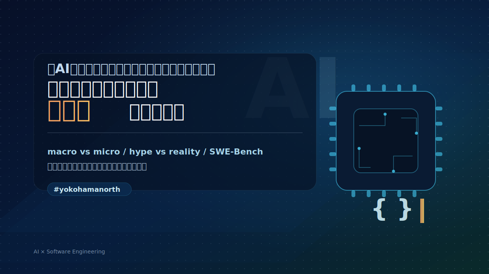

<!-- header: "" -->
<!-- _class: nolead -->
# 「AIはソフトウェアエンジニアをリプレイスするか」論争にそろそろ終止符を打ちたい

<!-- header: "#yokohamanorth" -->
## Index
1. 自己紹介
2. 
3. 
4. 
5. まとめ
6. Appendix

## 自己紹介:
name: 塚本 久博
yokohamanorth: 2回目
address: 港北区大倉山（横浜在住26年）
job_description: クラウドソーシングマッチングプラットフォームの開発責任者

## 今日はAIの話します
* 新しいLLMが、SWE-BENCHを更新するたび **「まもなくAIはソフトウェアエンジニアの仕事を奪う」** といった記事や動画が出る
* そのたびに思うこと
 
<!-- _class: nolead -->
## うるせえ

<!-- _class: caption -->
## なぜ私はこんな感情を抱くのか
- 前提として、私はカントの統整的概念という考え方に傾倒がある
  - （すごくざっくり言うと）この世界について、正解を出したつもりにならずに答えを探求し続けること
  - なので、答えの見えづらいものに問いをもたせたままにすることには大して抵抗がない人間である

### とはいえ
- 「仕事を失うかもしれない」という言説は強い不安を誘引し、当事者の視野を狭める弊害がある
- 利用可能性ヒューリスティックやSlippy Slopeといった「人が生来的にもつ認知バイアス」につけ込んでいる

## 要はこのへんが気に食わない
実際、若手メンバーなどが不必要に惑わされているのを見て、終止符を打ちたい
* **今日ここで打ちたい**
* そもそも誰がなんのために言ってんの？
* 調査してみました

## 誰がなんのために？
###  メディア／テック系インフルエンサー
煽りそのものが仕事（目的）の人
- 目的は 「注目、拡散、視聴維持」
- クリックベイトになる表現にしないと死んでしまう（構造上仕方がない）

---
### 投資家（VC / PE / アナリスト）・マクロ系の論者
- **関心**：市場規模、雇用構造の変化、利益率改善、勝ち筋（どこに投資すべきか）
    
- **言い方**：「ソフトウェア開発コストが劇的に下がる」「エンジニア需給が逆転する」など
    
- **背景**：**“労働”より“資本（モデル/データ/プラットフォーム）”が価値を持つ**というストーリーが作りやすい

---
### （特に開発者をコストセンターとみなしがちな事業モデルの）経営層・事業責任者
- **関心**：人件費・採用難・開発リードタイム短縮・利益率
    
- 「少人数で同じ成果」「開発組織は半分でよい」みたいな“生産性の物語”になりがち
    
- **背景**：投資家向けストーリーや、組織再編（採用抑制・レイオフ正当化）と相性がいい

要は言ってるのはマクロ観点の人たちである

## とは言っても、実際ビッグテックがレイオフ！のニュースは出てるじゃん
* これも内情は調べてもらいましょう
---
### MicrosoftやSalesforceがレイオフを公表する真の狙いは「社会へのスピーチ」である

1. 投資家へ
    
    → _「AIはもう“実験”ではない。コスト構造に効いている」_
    
2. 市場全体へ
    
    → _「次の生産性基準はこれだ」_
    
3. 顧客へ
    
    → _「我々はAIを“売る側”でなく“使っている側”だ」_
    
4. 社内へ
    
    → _「AI前提で働けないなら残れない」_

## 要はこれも同様にマクロ観点の人たちが言っていることである
- マクロの話をミクロ（現場）に安易に当てはめるの、どこかで見た光景ですね

## 業界全体で上がるよさそうな事例を自分たちにも導入しようやりがち
- Four Keysがよいらしいから、我々も計測しよう
- DDDやクリーンアーキテクチャがいいらしいから、我々も採用しよう
- マイクロサービスがいいらしいから、我々も採用しよう

## まとめ
- マクロの言説に惑わされない胆力が問われている
- AIによってソフトウェアエンジニアの仕事が変化するのは間違いない
- 今後「AIがエンジニアの仕事を奪う」といった記事を見かけたら、「ああ、インフルエンサーの人かな？」とか「この人はどのポジションでトークしてるのかな」と探ってみてください
