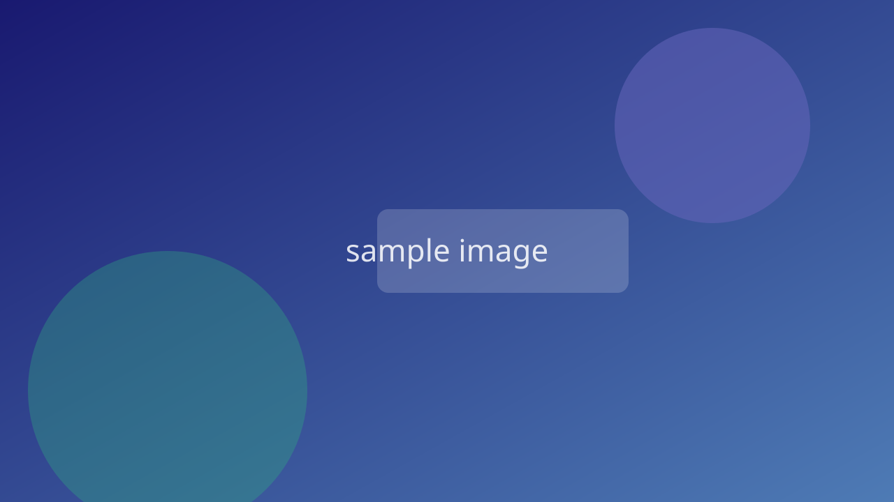

<!-- _class: lead -->
<!-- _paginate: false -->

# レイアウトパターン集



<!--
[P01: タイトル（lead + 背景写真）]
ポイント: `_class: lead` で見出しを中央寄せ・白文字に。背景は雰囲気を伝える写真やキービジュアル。
使いどころ: デッキの表紙。`_paginate: false` でページ番号を消す。
-->

## このカタログの使い方

1. スライドを新規作成・修正する前に、まず `docs/style-guide.md` を読む
2. 表現したい内容に近いパターンをここから選ぶ
3. 該当スライドのMarkdownソースをコピーして書き換える

各スライドのHTMLコメントに「ポイント」と「使いどころ」を記載している

<!--
このデッキ自体が動作するサンプル。`pnpm dev:tmp` でプレビューできる。
-->

## P02: タイトル（nolead + タイトル画像）

`_class: nolead` は見出しテキストを透明化し、タイトルが描き込まれた画像そのものを表紙にする。見出しはOGP・アウトライン用に書いておく（表示されない）。

```markdown {name=nolead-title.md}
<!-- _class: nolead -->
# スライドタイトル

```

<!--
使いどころ: デザイン済みのキービジュアルがあるとき。実例: product_profit_junction.md
このスライドで実演すると見出しが消えてカタログとして読めないため、コードで示している。
-->

## Index

1. セクション名
2. セクション名
3. セクション名
4. まとめ

<!--
[P03: 目次]
ポイント: 番号付きリストのみ。装飾しない。
使いどころ: 表紙の直後に1枚。
-->

## セクション扉（暗背景・白文字）

セクションの導入文をここに1〜2行で書く


<!-- _class: caption -->

<!--
[P04a: セクション扉（暗背景）]
ポイント: `_class: caption` は h2 と本文を中央寄せ・白文字にする。暗めの背景画像が必須（ないと白背景×白文字で不可視になる）。
このスライド以降のヘッダーに現在地を出すなら、直後に header ディレクティブ（`header: セクション名` をHTMLコメントで）を置く。
実例: engineering_policy.md「価値（Value）」
注意: HTMLコメント内にコメント終了記号を含む例文を書くとそこでコメントが閉じて本文に漏れる。
-->

## セクション扉（明背景・紺文字）

背景画像を使わない扉はこちら

<!-- _class: caption-light -->

<!--
[P04b: セクション扉（明背景）]
ポイント: `_class: caption-light` は中央寄せのみで文字色はテーマ既定（紺）のまま。背景画像なしで成立する。
使い分け: セクションを象徴する写真・ビジュアルがあるなら caption、ないなら caption-light。1つのデッキ内でどちらかに統一する。
-->

## P05: 定義・引用

> 複雑な対象を部品に分解して個別に理解すれば、その合計で全体も理解できるとする思考の型

出典リンクを引用の直後に置く: [Software Engineering Code of Ethics](https://dl.acm.org/doi/pdf/10.1145/265684.265699)

<!--
ポイント: 概念の定義は blockquote で示し、*em*（緑）で重要語を強調する。出典リンクを必ず添える。
使いどころ: 議論の土台となる用語・概念の導入。実例: engineering_policy.md「ソフトウェアエンジニアとは」
-->

## P06: 本文 + 右画像

- 本文は左側に箇条書きで書く
- 画像の情報量に応じて幅を40〜60%で調整する
- **強調は1スライド3箇所まで**


<!--
ポイント: 標準は `![bg right:55% fit]`。図が主役なら60%、補助なら40%。
使いどころ: 図解と説明を並べる、最も使用頻度の高いパターン。
-->

## P07: 全面透かし背景

#### 概念を象徴する図の上に、メッセージを重ねて語る

- 透過を強くする（`opacity:.15`）ことで本文の可読性を確保する
- 同じ図を前のスライドで `opacity:.5` で見せてから、このパターンで続けると文脈がつながる


<!--
ポイント: `![bg 75% opacity:.15]`。図を「背景の気配」として使う。
実例: engineering_policy.md「時間効率性」
-->

## P08: 2カラム比較（Before / After）

::::c
:::_
### Before {.red}
- 従来のやり方
- 課題点を書く
:::

:::_
### After {.green}
- 新しいやり方
- 改善点を書く
:::
::::

<!--
ポイント: `::::c` で等幅カラム（内側の `:::_` よりフェンスを長くする）。対比の意味を色で補強する（.red=課題、.green=解決）。アクセントはこの2色で打ち止め。
使いどころ: Before/After、選択肢A/B、賛否の対比。
-->

## P09: 項目が多いリストの2カラム分割

::::c
:::_
- 項目1
- 項目2
- 項目3
- 項目4
:::

:::_
- 項目5
- 項目6
- 項目7
- 項目8
:::
::::

<!--
ポイント: 箇条書きが5項目を超えたら縮小せず2カラムに分ける（style-guide.md 原則2・3）。
`::::c` の中で `:::_` がカラムの単位になる（外側のフェンスを長くする）。
-->

## P10: 数字・統計の強調

50億ドル{.text-xl4 .red}

米国FTCがFacebookに科した記録的な罰金額

<!--
ポイント: 数字だけを `.text-xl4` 以上で大きくし、アクセント1色を添える。説明は通常サイズで簡潔に。
使いどころ: インパクトのある統計・実績を1枚で見せる。
-->

## P11: アラートによる補足

本文をここに書く

:::_ {.important}
複数行にわたる補足は
グルーピングコンテナにクラスを付与する
:::

一行だけなら段落末尾に付与する {.note}

<!--
ポイント: .note(情報) / .tip(推奨) / .important(重要) / .warning(注意) / .caution(危険) の5種。1スライド1つまで。
-->

## P12: コードブロック + ファイル名

```js {name=engine.mjs}
export default ({ marp }) => marp
  .use(markdownItContainer, 'c')
  .use(markdownItAttrs)
```

<!--
ポイント: `{name=ファイル名}` でコードブロックにファイル名タブが付く。ハイライトはPrism（VS Code Dark+）。
コードは10行以内に切り出す。全文を見せたいときはリンクにする。
-->

## P13: 不採用案を見せる

- ### **品質**に誇りと責任をもつ
- ### **技術者倫理**に基づく
- ### ~~**全体の最大利益**を求める~~

<!--
ポイント: 検討したが採用しなかった項目を取り消し線で残す。意思決定の過程を見せることで議論を誘発する。
実例: engineering_policy.md「原則」
-->

## まとめ

- パターンを選んでから書き始める（構造が先、文章が後）
- 色は意味で使う。1スライド1〜2色まで
- 収まらないときは、縮小ではなく分割・削減

<!--
[P14: まとめ]
ポイント: 箇条書き3〜4項目 + strong強調のみのシンプル構成。新しい情報を足さない。
-->
